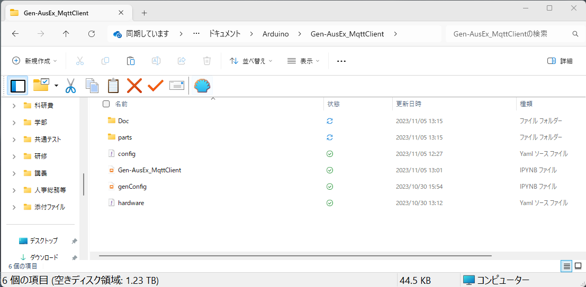
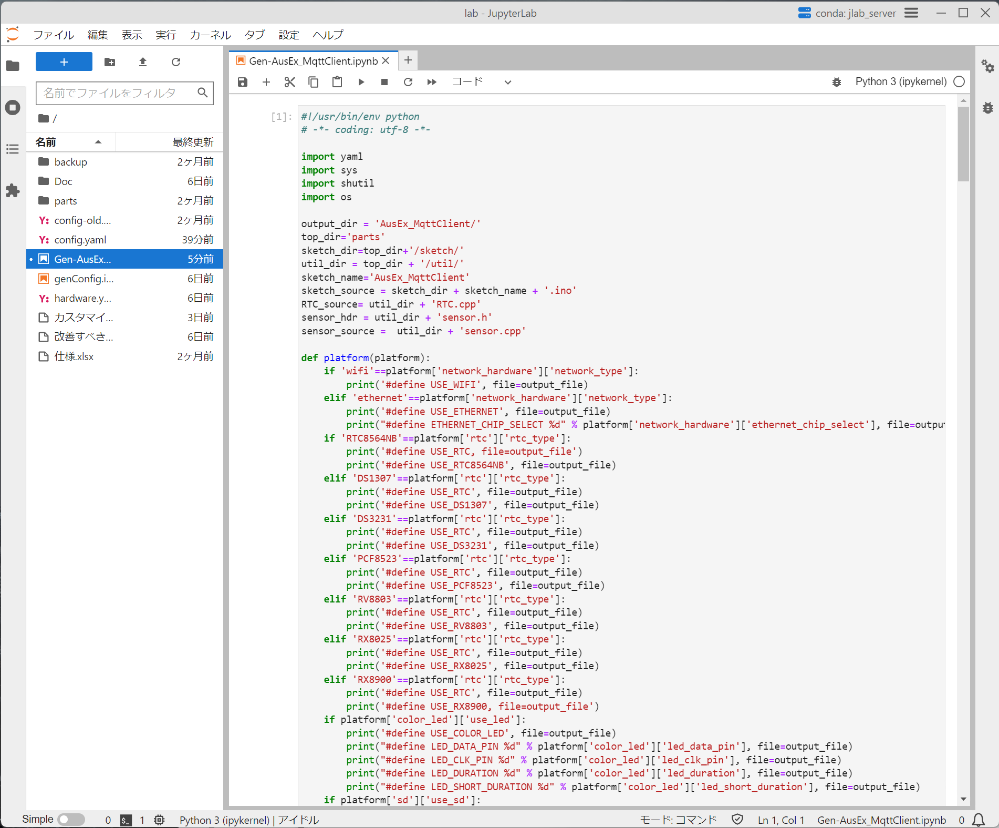

# Arduinoスケッチ(プログラム)の生成
本プロジェクトの各種ファイルと編集した「config.h」が同じディレクトリにあることを確認する(下図参照)．

この時，Arduino用スケッチが格納されているディレクトリ(「AusEx_MqttClient」)が無いことを確認．
もし，存在した場合は削除する．

## スケッチ生成用プログラムを開く

jupyterlabで「Gen-AusEx_MqttClient.ipynb」を開く(下図)．

## スケッチ生成
ウィンドウ上部の「実行」ボタンをクリック

この時，下図のように，エラーなく実行が終了していれば生成に成功．

## 出力されたスケッチの確認

Arduino用スケッチが格納されているディレクトリ(「AusEx_MqttClient」)が作られていることを確認．

.png)

***
- [「スケッチのインストール」に進む](Install.md)
- [「センサの定義」に戻る](SensorDefinition.md)
- [「README」に戻る](../README.md)
