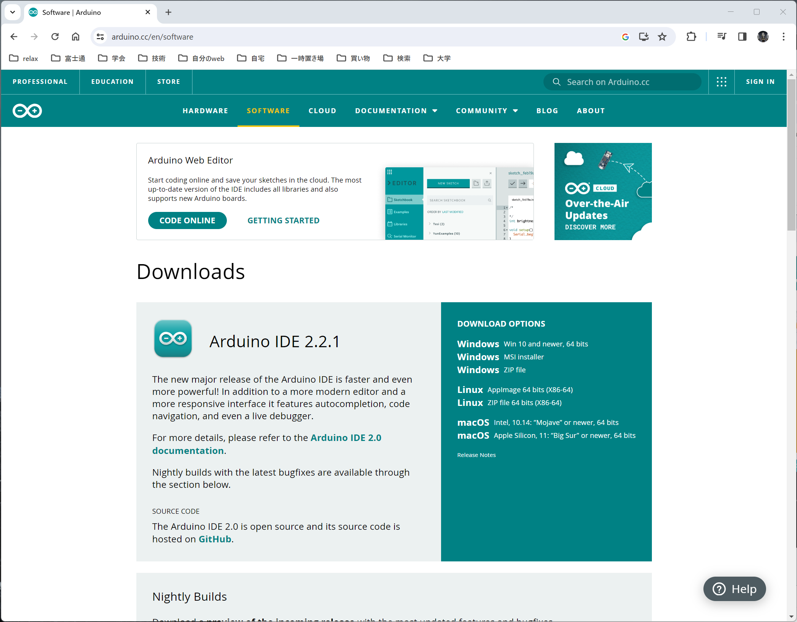
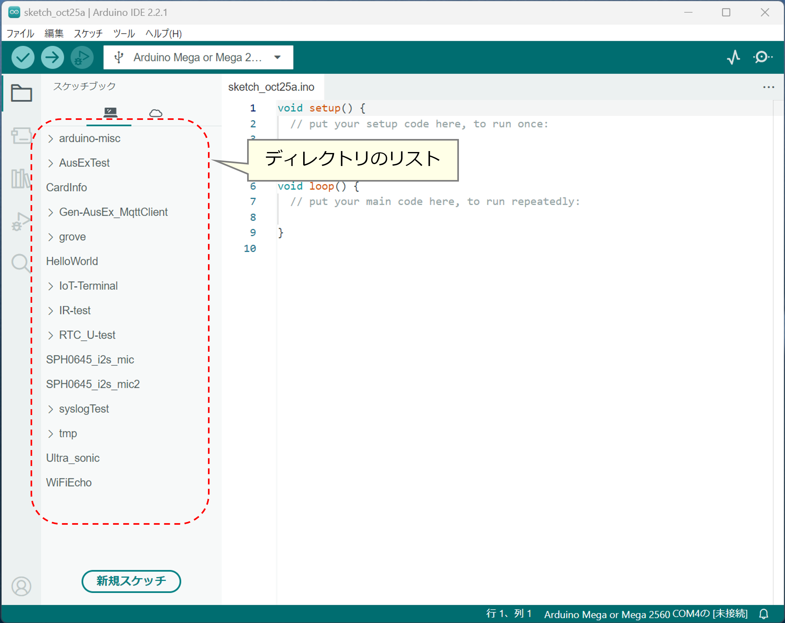
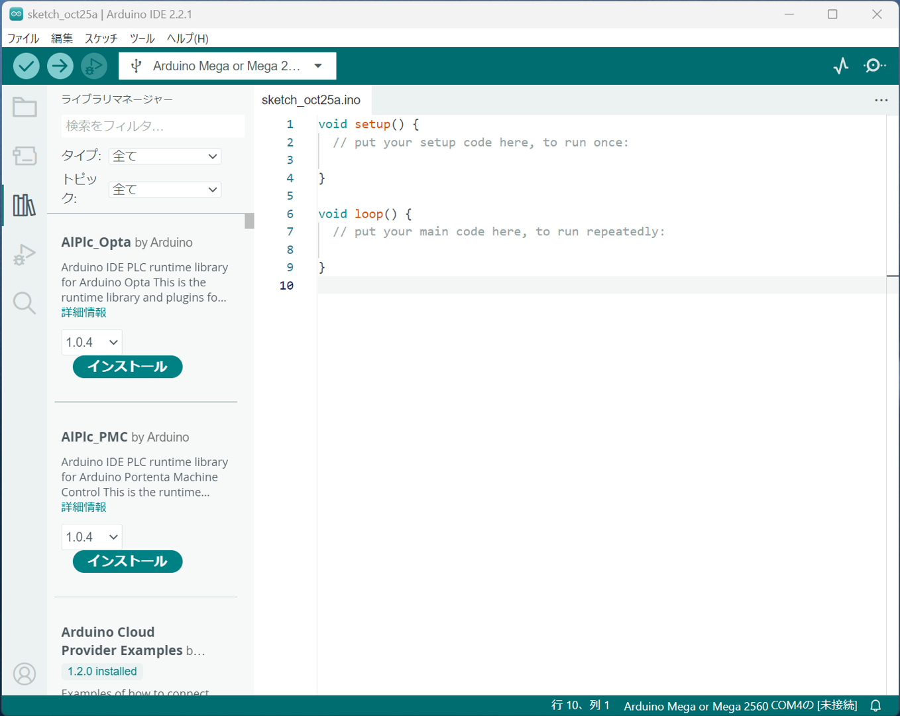
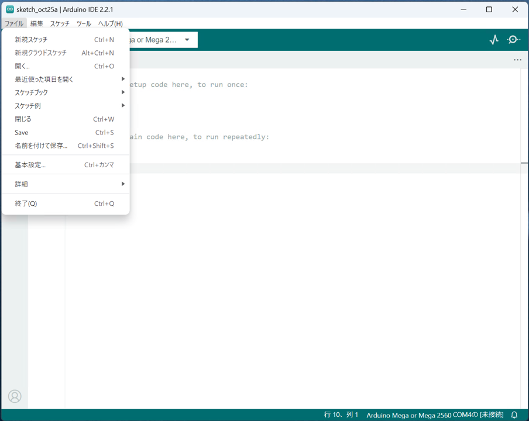
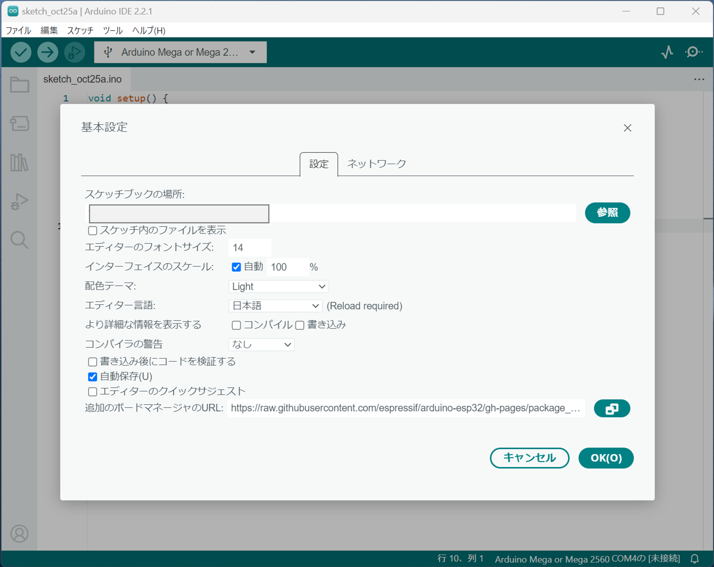
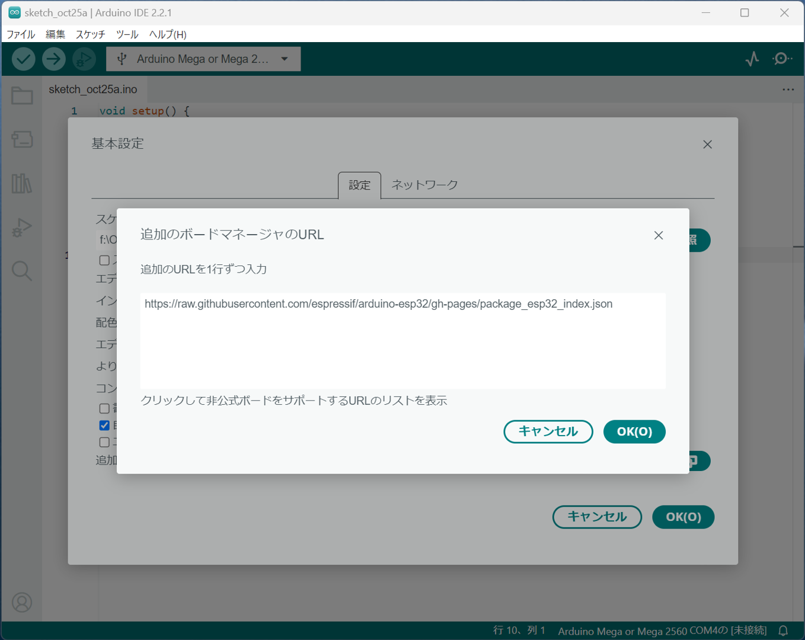

# Arduino IDEのインストール


## ダウンロードとインストール
[Arduino公式](https://www.arduino.cc/)にアクセスし，下図のように，「SOFTWARE」をクリック．


開発環境のソフトウェアをダウンロードするページ(下図)にジャンプするので，Arduino IDEの最新版を
ダウンロードする．



ダウンロードしたインストーラーを実行して，インストールを行う．

## Arduino IDEの画面構成

インストールしたArduino IDEを実行すると下図のような画面が表示される(Windowsの場合)．


- ファイルメニュー : 既存のArduinoのプログラム(スケッチと呼ぶ)にアクセスするためのファイルメニュー
- ボードメニュー : Arduinoの各機種(ボード)や互換機のプラグインを管理(インストール，バージョン管理，削除)するためのメニュー
- ライブラリメニュー : ライブラリを管理(インストール，バージョン管理，削除)するためのメニュー


### ファイルメニュー
下の図はファイルメニューをクリックした状態の図である．
ファイルメニューに文字列のリストがあるが，これは，Arduino IDEの環境設定で，スケッチやライブラリの置き場所として指定されているデフォルトのディレクトリが表示されている．
これを操作して，既存のスケッチを開くことができる．



**デフォルトの場所**

ユーザのホームディレクトリの下にある「ドキュメント」ディレクトリ内に「Arduino」ディレクトリが作成され，そこがデフォルトのスケッチの置き場所になる．

以下は，Windowsの場合の事例
```
C:\Users\xxx\ドキュメント\Arduino
C:\Users\xxx\OneDrive\ドキュメント\Arduino
```

### ボードメニュー
下図はボードメニューのクリックした状態である．
リストに表示されているのは，Arduino IDEが認識している(インストール可能もしくはインストール済み)のボード用プラグインのリストである．

タイプのタブから特定の項目を選択する，もしくは，キーワード検索をすることで，絞り込みを行うことができる．


こちらも，サードパーティの互換機を利用する場合は，Arduino IDEの環境設定で，プラグインの情報を追加することができ，その後は，ボードメニューからプラグインの追加削除バージョンアップが可能になる．

### ライブラリメニュー

下の図はライブラリメニューをクリックした状態の図である．



Arduinoのライブラリには，以下の3種類があり，最初の2種類はこのメニューから導入できる．

- Arduino公式が開発したもの
- 3rdパーティーが開発し，Arduinoに申請して認められたもの
- その他

2番目の種類のライブラリは，3rdパーティーが開発し，githubなどにソースを公開した上で，Arduinoプロジェクトに申請を行うと，認められたものはArduino IDEに登録され，ライブラリメニューで管理できるようになる．

3番目には，完全に自分でインストール等の管理を行う必要がある．

**ライブラリの置き場所**

ユーザのホームディレクトリの下にある「ドキュメント」ディレクトリ内に「Arduino」ディレクトリが作成され，
さらにその内部に「libraries」ディレクトリが作成される．

ここが，ライブラリを配置するデフォルトのディレクトリとなる．

以下は，Windowsの場合の事例
```
C:\Users\xxx\ドキュメント\Arduino\libraries
C:\Users\xxx\OneDrive\ドキュメント\Arduino\libraries
```

自分で導入する全てのライブラリはこの場所に置く必要があり，設定したディレクトリの中でディレクトリを作成して分類するなどはできない．

**手動でのライブラリインストール**

自分でダウンロードしたライブラリをライブラリ置き場所の「ディレクトリ」に置けば良い．


## 環境設定
Arduino IDEの環境設定を変更する場合，最初に起動画面の上部メニューの「ファイル」メニューを開き，「基本設定」を選択する．



基本設定の「設定」のうち，「スケッチブックの場所」を変更すれば，スケッチ(プログラム)やライブラリを保存する場合のディレクトリを変更することができる．



上図の「追加ボードマネージャのURL」の右端のアイコンをクリックすると，以下の画面が開く．


上の図は，追加のボードマネージャのURLを追加する画面であり，互換機等を追加していく際は，互換機を販売しているメーカーの
指示に従い，URLを追加する．

上図では，ESP32 (中国メーカーのWiFi内蔵MCU)のボードマネージャの定義を追加した状態である．


***
- [「Arduino IDEのライブラリの準備」に進む](Library.md)
- [「README」に戻る](../README.md)