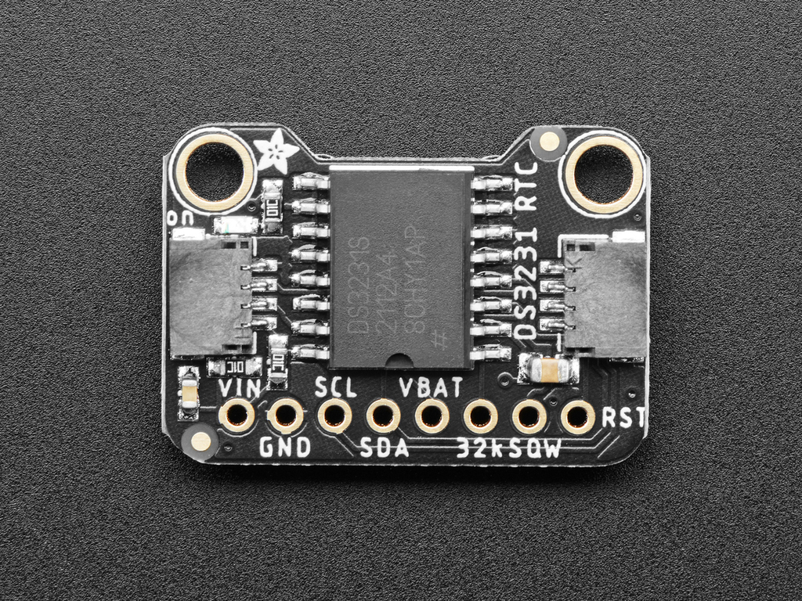
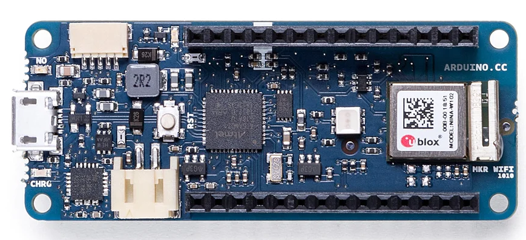
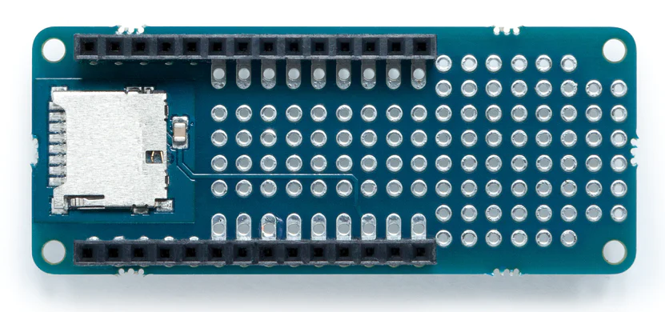
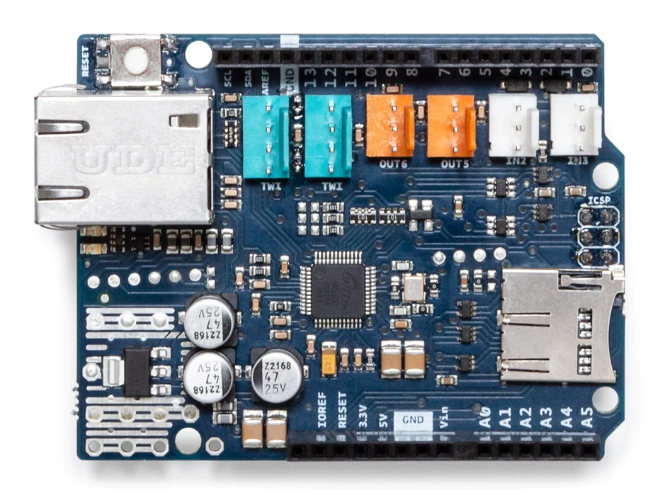
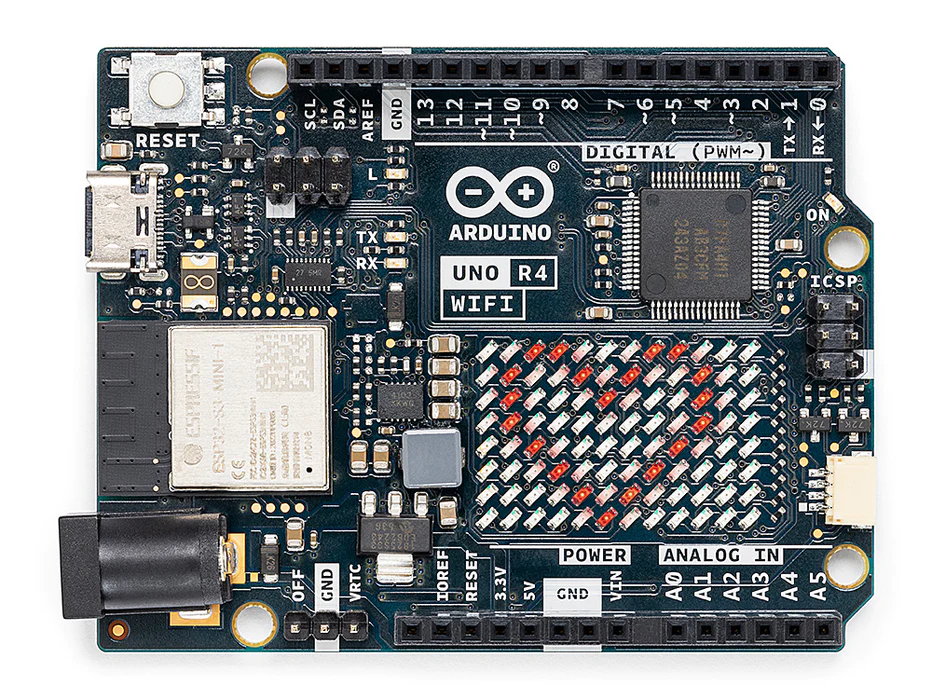
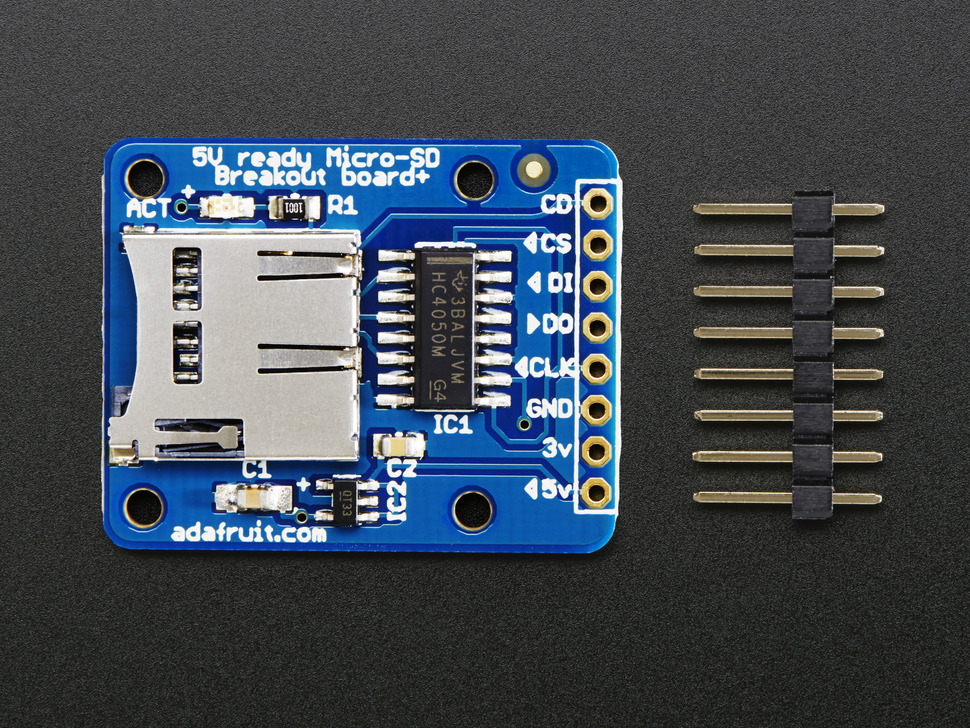

# 利用するマイコン

センサを接続するだけでセンサ系のIoT端末のハードウェアとして動作する物が配布される．
配布されるハードウェアは以下うちの何れかである．

- MKR Zero + MKR Ethernetシールド
- MKR WiFi1010 + マイクロSDシールド
- Uno R4 Minima + Ethernetシールド
- Uno R4 WiFi + マイクロSDシールド
- Nano 33 IoT

## MKR Zero + MKR Ethernetシールド

### 構成部品
- Arduino MKR ZERO

https://store-usa.arduino.cc/products/arduino-mkr-zero-i2s-bus-sd-for-sound-music-digital-audio-data

- Arduino MKR ETH Shield

https://store-usa.arduino.cc/products/arduino-mkr-eth-shield

- Arduino MKR Connector Carrier

https://store-usa.arduino.cc/products/arduino-mkr-connector-carrier-grove-compatible

- Grove – Chainable RGB LED

https://www.seeedstudio.com/Grove-Chainable-RGB-Led-V2-0.html

- Adafruit DS3231 Precision RTC Breakout

https://www.adafruit.com/product/3013

- Grove - I2C Hub

https://www.seeedstudio.com/Grove-I2C-Hub.html

### イーサネットシールドのMACアドレス

PCやWiFi基地局，ルータ等はMACアドレスは機器に内蔵されたROMに記入されており，
プログラム上で記述する必要はないが，ArduinoはMACアドレスを持たないため，別途指定する必要がある．

Arduinoのイーサネットシールドのうち，Classicシリーズのシールドには，Arduinoの製造元が取得したMACアドレスが
記載されたシールが貼られているため，そのアドレスを利用すれば良い．一方，MKRのイーサネットシールドには
MACアドレスのシールがないため，自分でMACアドレスを決めて，そのアドレスをプログラム(Arduinoの場合はスケッチ)に記入する必要がある．

配布された装置のどこかに，アドレスが記入されたシールが貼られているはずであるので，それを探してメモしておく．
メモしたアドレスはプログラム作成の際に，設定ファイルに記入する．

### 使用済みのGroveコネクタ

センサ等を後に追加する場合に，I2C以外は既に使われている場所は利用できない．
Groveのコネクタのうち，D4,D5,D6とI2Cは既に使われている．

## MKR WiFi1010 + マイクロSDシールド

### 構成部品
- Arduino MKR WiFi 1010

https://store-usa.arduino.cc/products/arduino-mkr-wifi-1010

- Arduino MKR Connector Carrier

https://store-usa.arduino.cc/products/arduino-mkr-connector-carrier-grove-compatible

- MKR SD Proto Shield

https://store-usa.arduino.cc/products/mkr-sd-proto-shield

- Grove – Chainable RGB LED

https://www.seeedstudio.com/Grove-Chainable-RGB-Led-V2-0.html

- Adafruit DS3231 Precision RTC Breakout

https://www.adafruit.com/product/3013

- Grove - I2C Hub

https://www.seeedstudio.com/Grove-I2C-Hub.html

### 使用済みのGroveコネクタ

センサ等を後に追加する場合に，I2C以外は既に使われている場所は利用できない．

配布されたシステムでは，デジタル端子の4(D4)は，マイクロSDシールドのチップセレクト，D5,D6はLEDで利用されているため，
センサやその他の周辺回路を接続することができない．

## Uno R4 Minima + Ethernetシールド

### 構成部品
- Arduino® UNO R4 Minima

https://store-usa.arduino.cc/products/uno-r4-minima

- Arduino Ethernet Shield 2

https://store-usa.arduino.cc/products/arduino-ethernet-shield-2

- Arduino用 Groveベースシールド

https://jp.seeedstudio.com/Base-Shield-V2.html

- Grove – Chainable RGB LED

https://www.seeedstudio.com/Grove-Chainable-RGB-Led-V2-0.html

- Adafruit DS3231 Precision RTC Breakout

https://www.adafruit.com/product/3013

### イーサネットシールドのMACアドレス
Classicシリーズ用のイーサネットシールドには，MACアドレスを記載したシールが貼られているはずである．
そのため，この数字(16進数6個組)をメモしておく．

このアドレスはプログラムを生成する際に，定義ファイルに書き込む．

### 使用済みのGroveコネクタ

センサ等を後に追加する場合に，I2C以外は既に使われている端子は利用できない．

デジタル端子の4と10(D4とD10)はそれぞれ，マイクロSDとイーサネット回路のチップセレクトとして利用されるため，
センサやその他の周辺回路を接続することができない．また．
I2Cコネクタ4つのうちの1つとLEDで6番7番端子を使っているため，下図のバツ印のところは利用不可である．

## Uno R4 WiFi + マイクロSDシールド

### 構成部品
- Arduino® UNO R4 WiFi

https://store-usa.arduino.cc/products/uno-r4-wifi

- Arduino用 Groveベースシールド

https://jp.seeedstudio.com/Base-Shield-V2.html

- SD Card Shield
https://www.seeedstudio.com/SD-Card-Shield-V4-p-1381.html

- SparkFun microSD Shield
https://www.sparkfun.com/products/12761

- ピンヘッダ
https://www.adafruit.com/product/85
https://akizukidenshi.com/catalog/g/gC-17103/
https://akizukidenshi.com/catalog/g/gC-17102/

- マイクロSD : 好きなものを購入すれば良い(ただし，16GB以下)．

- Grove – Chainable RGB LED

https://www.seeedstudio.com/Grove-Chainable-RGB-Led-V2-0.html

- Adafruit DS3231 Precision RTC Breakout

https://www.adafruit.com/product/3013

## Arduino Nano 33 IoT

### 構成部品

Arduino Nano 33 IoT

https://store-usa.arduino.cc/products/arduino-nano-33-iot

Grove Shield for Arduino Nano

https://www.seeedstudio.com/Grove-Shield-for-Arduino-Nano-p-4112.html

マイクロSDモジュール

https://www.adafruit.com/product/254

- Grove – Chainable RGB LED

https://www.seeedstudio.com/Grove-Chainable-RGB-Led-V2-0.html

- Adafruit DS3231 Precision RTC Breakout

https://www.adafruit.com/product/3013

- Grove - I2C Hub

https://www.seeedstudio.com/Grove-I2C-Hub.html

### 使用済みのGroveコネクタ

センサ等を後に追加する場合に，I2C以外は既に使われている場所は利用できない．

I2CコネクタとLEDで6番7番端子を使っている．また，SPIで4つのピンを使っているが，対応するGroveコネクタが存在しないため，SPIは気にしなくて良い．

以上から，Groveシールドのうち，下図のバツ印のところは利用不可である．

## Arduino Nano ESP32

### 準備するもの

Arduino Nano ESP32

https://store-usa.arduino.cc/products/nano-esp32

Grove Shield for Arduino Nano

https://www.seeedstudio.com/Grove-Shield-for-Arduino-Nano-p-4112.html

- Grove – Chainable RGB LED

https://www.seeedstudio.com/Grove-Chainable-RGB-Led-V2-0.html

- Adafruit DS3231 Precision RTC Breakout

https://www.adafruit.com/product/3013

- Grove - I2C Hub

https://www.seeedstudio.com/Grove-I2C-Hub.html

***

- [「マイコンインターフェース解説」に進む](Arduino_IF.md)
- [「マイコンとArduinoの概要」に戻る](Arduino.md)
- [「README」に戻る](../README.md)
