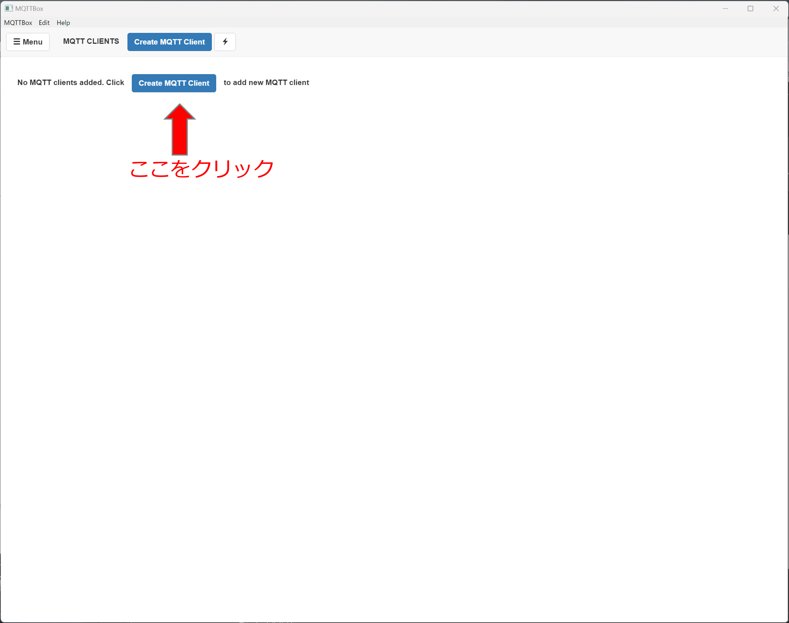
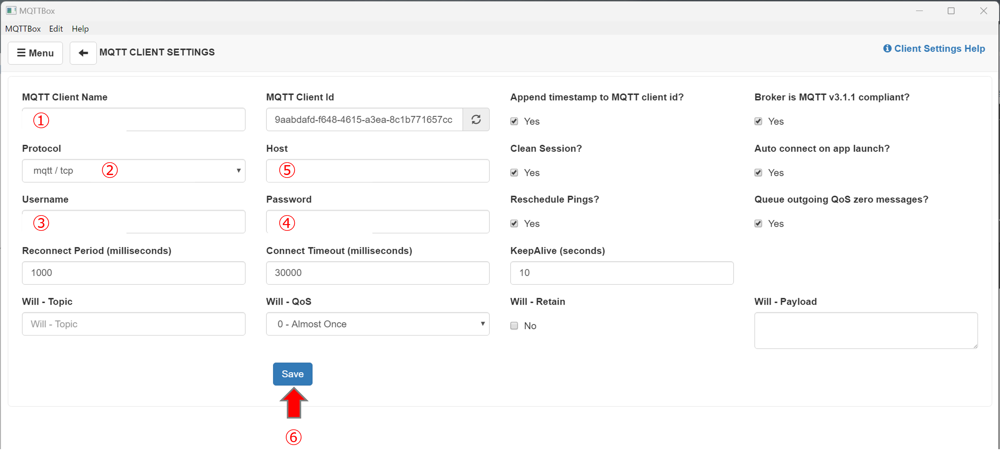
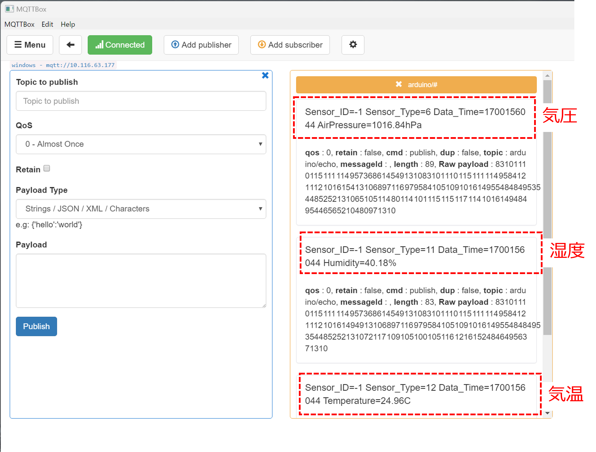

# 動作確認(MQTTアプリケーション編)
下の図はユーザが開発するセンサ端末の動作テストに利用する環境を示している．
ユーザが動作確認に用いるのは開発用PCとなる．

## テスト用アプリケーションのインストール

テストに用いるアプリケーションは，「MQTT Box」というMQTTクライアントアプリケーションである．
まず，最初にMQTT Boxをインストールする．
MQTT BoxはMac, Windows, Linux, Chrome OSの全てで動作するアプリケーションで，下図は
マイクロソフトストアのMQTT Boxの画面である．

## MQTT Boxの設定
下の図はMQTT Box起動時の初期画面である．最初に，「Create MQTT Client」ボタンを押す．

次に，Arduinoのテストに用いるパラメータを設定する．

- ➀ 適当な名前を入力
- ➁ 「mqtt/tcp」を選択
- ➂,➃ MQTTの認証を行う場合は，認められているユーザ名とパスワードを入力
- ➄ mosquittoが動作するIoTゲートウェイのIPアドレスを入力
- ➅ 「Save」ボタンを押す

➀は，MQTTに関する設定を保存して，別の時に流用するために用いるものであるため，特に規制はない．
➂と➃に入力する項目については，MQTTの認証を行うか否かであるため，IoTゲートウェイのIPアドレスや認証のユーザ名(とパスワード)は管理者に確認すること．
➄については，管理者から教えられたIoTゲートウェイの情報を入力する．

MQTT Boxのクライアント画面の右側(subscribe欄)に，Arduino設定で定義した「トピック」の文字列を入力し，「Subscribe」ボタンを押す．

## MQTT Boxによる動作確認
下の図は，温湿度・気圧センサであるBME280を搭載したArduinoをテスト環境のネットワークに接続した場合の画面である．
この図にあるように，一番上に気圧，次に，気温，最後に温度が出力されているのが読み取れる．

先程の温度,湿度,気圧の出力文字列と下図のような，Arduino IDEのシリアル監視画面に出力されている内容が一致していることを確認する．

***
- [マニュアルトップに戻る](../Manual.md)
