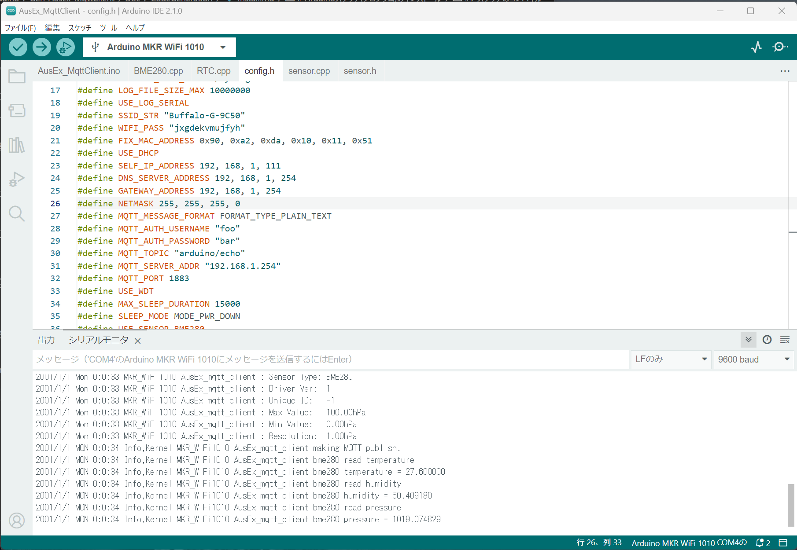

# Arduinoスケッチ(プログラム)のインストール

## スケッチをIDEで開く

先程スケッチを生成したディレクトリを開き(下図)，スケッチ(AusEx_MqttClient.ino)をダブルクリック．
下図の例は，センサとして「BME280」のみを選択した事例である．

Arduino IDEが立ち上がり，スケッチとセンサ等のソースが読み込まれる．

## 組み立てたArduinoをPCに接続

組み立てたArduinoをPCに接続し，IDEのボード選択ウィンドウで，接続したArduinoを選ぶ．下図の例はCOMポートの4番にArduino MKR WiFi1010が
接続された状態の例となっている．

## スケッチのコンパイル
下図に示すコンパイルとインストールを行うボタンをIDEでクリック．

下図のように，エラーなく終了していれば成功．

ここで，シリアルモニタを開き，ArduinoがUSBに出力しているログを確認する．
シリアルモニタでセンサによる測定結果ののログが出ていれば端末として動作している．

### 動作する条件
出力されるArduinoのスケッチは，IoTネットワークに接続し，MQTTブローカと
接続できなければ，センサによる測定にまで行かないため，
ネットワークの敷設，IoTゲートウェイおよびMQTTブローカが
動作していることを確認する．

自分でIoTネットワークを運用していない場合は，管理者に
確認すること．

## LEDの監視

カラーLEDを見ることで，ある程度の動作はわかる．

端末起動直後は「青」が点灯し，ネットワークの設定作業中は「紫」が点灯する．

その後，測定時に「緑」が点灯した後，次回の測定までの待ち時間はLEDが消灯する．

それ以外の色で点灯した場合は，何らかの不具合である．

***

- [「Arduinoスケッチ(プログラム)の生成」に戻る](genSketch.md)
- [マニュアルトップに戻る](../Manual.md)

