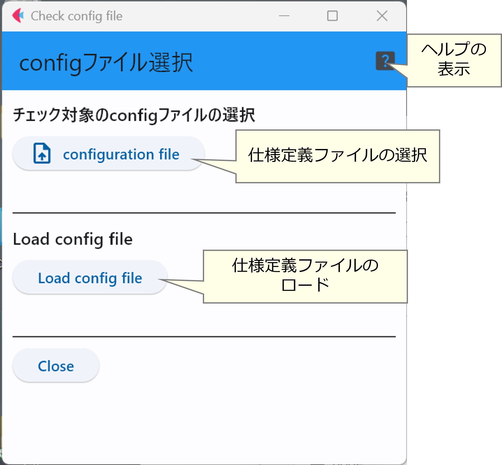
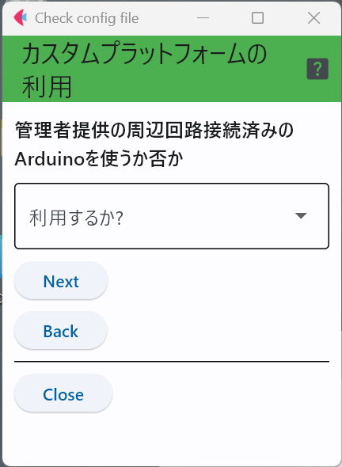
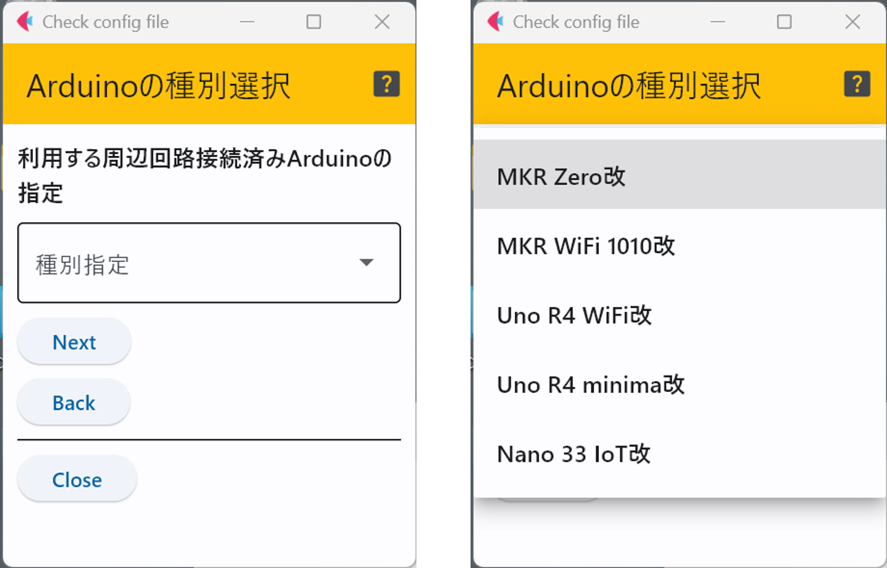
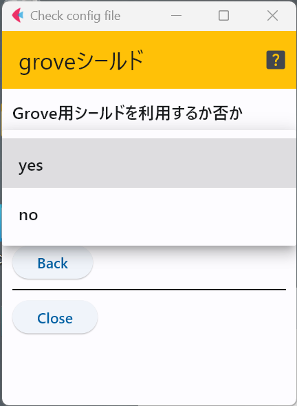
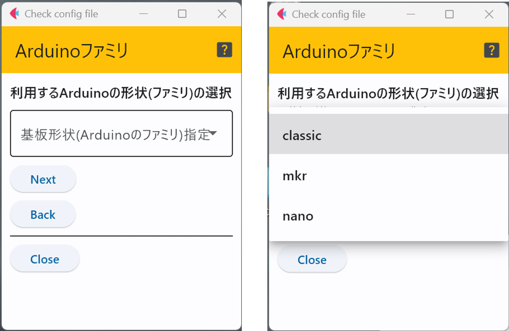
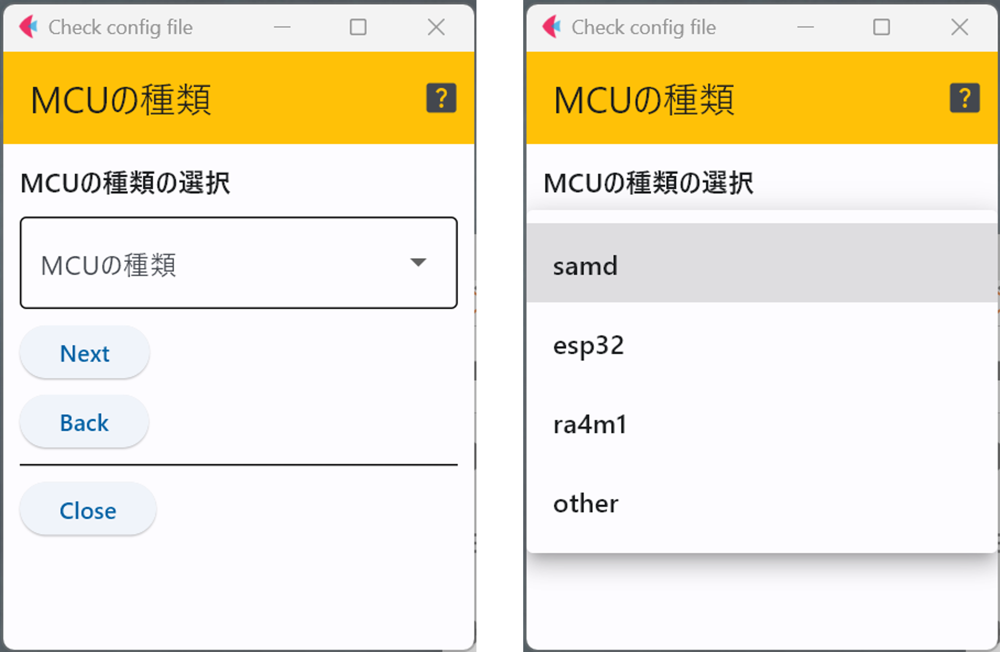
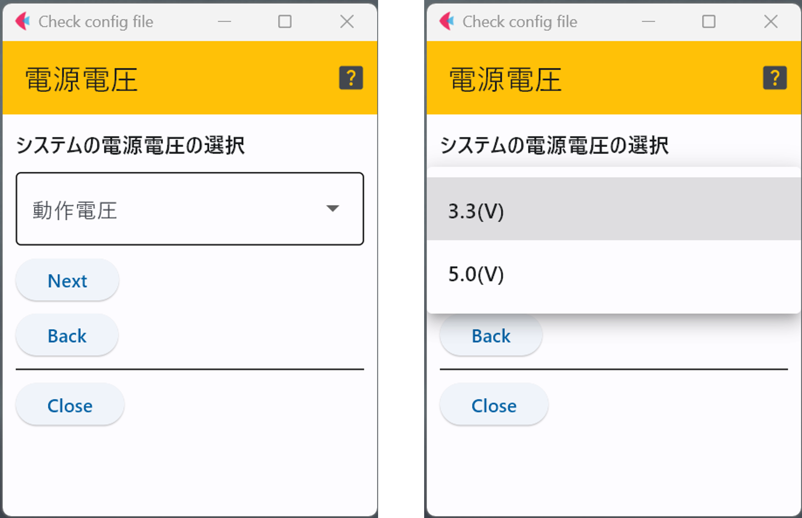
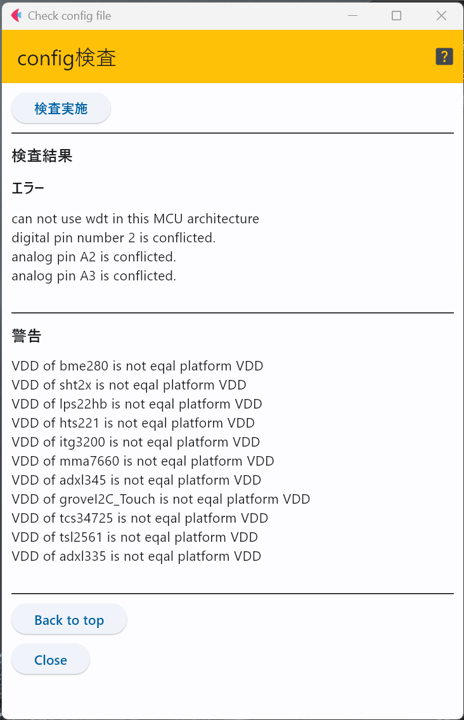

# 仕様定義ファイルのチェック : ``checkConfig.py``

作成した仕様定義ファイルの内容に明らかな問題が無いかをチェックするプログラムが``checkConfig.py``である．

下図は起動時の画面であるが，このページでは，チェック対象のファイルを選択し，そのファイルをロードするところまでを行う．

次に，管理者の推奨プラットフォームを利用するか否かを指示する．
このプログラムでは，管理者が配布したハードウェアのMCUの種類や
LED等で利用されているピン番号等を記載したconfigファイルを起動時にロードしているため，
管理者がArduinoおよびRTC等の周辺回路を用意している場合，
用意されたハードウェアの情報を用いて，仕様の整合性の検査を行う．

何れかを選択したら，「Nextボタン」で次に進む．

## 事前に準備されたシステムを用いる場合
管理者が用意したベースとなるシステムの利用を選択した場合，
どのシステムを用いるかをここで選択する．

管理者が用意したconfigファイルに規定されたシステムの
名前の中から，渡された装置の名前を選択する(下図右)．

事前に準備されたシステムを用いる場合は，選択肢は
これで終了し，「Nextボタン」で診断画面に遷移する．

## 事前に準備されたシステムはない(もしくは利用しない)場合
事前に用意されたシステムが存在しない，もしくは，用意されたものを利用しない場合は，
実際に使う機材のハードウェアの情報を順次入力していく．

### Arduinoの機種選択
最初に，Arduinoの機種を選択する．選択肢には，動作が確認された純正のArduinoか
動作しない可能性はあるが，その他を選択することができる．

### Grove対応シールドの利用
ここでは，Seeed Studio社の[Groveシールド](https://jp.seeedstudio.com/Base-Shield-V2.html)や[Arduino MKR Connector Carrier](https://store-usa.arduino.cc/products/arduino-mkr-connector-carrier-grove-compatible)を利用するか否かを選択する．

動作が確認されているArduinoの機種を用いる場合は，ここで選択は終了し，「Nextボタン」で診断画面に遷移する．

### Arduinoの機種が選択「その他」で，「Groveシールド」を用いる場合
Groveシールドを用いる場合，コネクタ数やどのピンにコネクタが割当てられているかが
Arduinoのファミリによって異なるため，ファミリの種類を選択する．

なお，現在このソフトウェアはMegaファミリ(MegaおよびGita)には対応していない．

### MCUの種類の選択
Arduinoの機種が「その他」であるため，仕様する機種に搭載しているMCUの種別を選択する(下図)．
選択できるのは，動作が確認されているMCUと「other(動作未確認)」である．

MCUの種別が「other」でなければ，これで選択は終わり，「Nextボタン」で診断画面に遷移する．

### 動作電圧の選択
ここでは，利用するArduino(もしくは互換機)の動作電圧を選択する．
選択可能なのは，3.3Vと5.0Vの2種類である．
この電圧は，ACアダプタから給電する電圧ではなく，回路の動作電圧であることに注意．

## 検査
本ソフトウェアにおける検査には以下のような項目がある．
- MCU対応機能の確認
- 動作電圧のチェック
- 端子の重複利用

### MCU対応機能の確認
この項目では，生成させるArduinoのスケッチが利用しているライブラリがMCUに対応しているか否かの組み合わせを検査する．

検査するのは，以下の2種類．
- Watch Dog Timer (WDT)
- MCUの省電力モード(sleep機能)

WDTは，MCUが無反応になった場合に再起動させて動作を復帰させるための機能であり，省電力モードは処理の無い時間帯に
消費電力を抑制するために，MCUの回路の一部を停止させるものである．

そのため，仕様定義ファイルで，WDTや省電力モードの利用が宣言されているにも関わらず，利用している機種のMCUが
これらの機能のライブラリでサポートされていない場合にエラーとして報告される．

### 動作電圧チェック
Arduino(や互換機)が搭載しているMCUの動作電圧と，利用するセンサの動作電圧が一致していない場合に警告(エラーではない)を出力する．
エラーにしない理由は，ハードウェア的にセンサICの動作電圧とモジュールにした際につけられた周辺回路の関係で，実際の動作電圧が一致しない場合が
あるためである．

具体的には，センサICの周りに信号電圧を変換する回路をつけることで，動作電圧を変化させることは珍しくなく，ICの動作電圧と
センサモジュールの動作電圧の範囲が一致しているとは限らない．

### デジタル/アナログ端子の重複利用
I2CやSPIのデータ通信用の端子を除くと，1つの端子に接続できる周辺回路は1つに限定される．そのため，SDやLEDと利用が宣言されているセンサの端子番号が同じものがないかどうかを確認する．

また，Arduinoのアナログ端子はデジタル端子としても利用できるため，これも確認している．これらの結果はエラーとして出力される．

### 検査画面
下図の画面が検査実施前の画面状態である．
先程までの検査パラメータの選択で特に問題がなければ「検査実施」ボタンを押す．
また，「Back to top」ボタンは検査対象のファイルを選びなおすところまで戻る．

### 検査の例
下の図は，とある仕様定義ファイルで検査した場合の出力である．

上の結果となった仕様定義ファイルとパラメータの概要は以下のようなものである．
- センサはすべてを使う設定
- デジタルのセンサは全てピン番号2番に接続する(エラーとなる)設定となっている
- アナログのセンサはピン番号がA2もしくはA3の何れかに統一
- 動作電圧を指定するセンサは全て3.3Vを指定
- Arduinoの機種としては，動作電圧が5Vのもの(Uno R4系列)を選択

このような状況のため，エラーとして大まかに以下の3種類が出呂されている．
- Arduinoの動作電圧が5Vであるのに，動作電圧が3.3Vにしていされているセンサが多数あるため，その警告がたくさん出力されている．
- アナログ端子A2,A3とデジタル端子の2番は複数のセンサが競合しているため，エラーとなっている．
- Uno R4系列の機種のルネサス製MCUは本開発環境で利用しているWDTと省電力機能のライブラリが対応していないため，WDT使用の設定がエラーとなっている．

実際に自分で仕様を定義した際に，エラーや警告が出力された場合は，上記の事例を参考に対処していただきたい．
なお，動作電圧に関しては，ICの動作電圧であり，センサモジュールの動作電圧をチェックしていないことに注意が必要．

***
- [「Arduinoスケッチ(プログラム)の生成」に進む](genSketch.md)
- [「仕様定義ファイル作成」に戻る](editConfig.md)
- [マニュアルトップに戻る](../Manual.md)