# 仕様定義ファイルの作成 : ``editConfig.py``

本ソフトウェアでは，端末開発者による対話的な操作により，最終的な仕様を定義するファイルを作成する．

また，管理者等から配布されたテンプレートもしくは，本ソフトウェア付属のサンプルの仕様定義ファイルを
ロードして，その項目を上書きしていく形で操作する必要がある．

また，このテンプレート機能を利用することで，以前自分が作成した仕様定義ファイルの修正/流用を
行うことも可能である．

## 本ソフトウェアの起動
UNIXのshellもしくはコマンドプロンプト等から，Pythonで起動する．
```
$ python editConfig.py
```

Linux等のUNIXやMacOSの場合は，このファイルに実行権限を付けることで，直接実行することが可能．

```
$ cp editConfig.py editConfig
$ chmod +x editConfig
$ ./editConfig
```

## 仕様テンプレートファイルの選択
下の図は起動直後の画面である．

本ソフトウェアは，ユーザが以前編集した仕様定義ファイルもしくはそれに準じるテンプレートを
読み込ませる必要があるため，この画面でそれを行う．

「configuration file」ボタンで，ロードさせる対象のファイルを選択し，「Load config file」ボタンで
ロードする．
この時，特にエラーが発生しなければ，次の画面に自動的に遷移する．

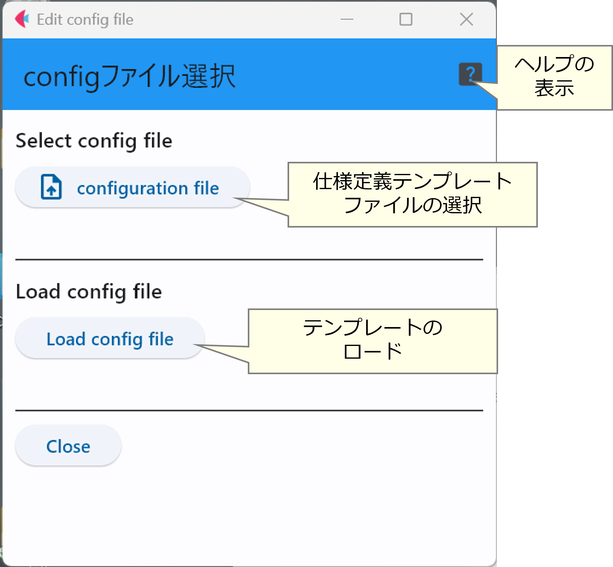

なお，管理者から，特別な指示が無い場合は，本ソフトウェアに付属のサンプルファイルをテンプレートとして用いることができる．

ただし，サンプルファイルは，本開発環境推奨の機器構成であることが前提になっているため，この点に注意していただきたい．

## 目次ページ
このページは，設定すべき項目をカテゴリ分類した目次のページとなる．
はじめて利用する場合は，一番上の「All option」ボタンで流れに沿って設定していく．

もし，以前設定した定義ファイルを流用している場合は，変更する部分が属するカテゴリにボタンを押してジャンプすれば良い．

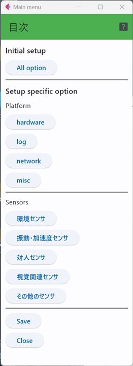

## ハードウェア関連
ここでは，ネットワークのインターフェースの種類等のハードウェアに関する項目を設定する．

### ネットワークインターフェースの種別
ここでは，利用する機材に付属しているネットワークインターフェースの種類を以下の2つから選択する．
- ethernet
- wifi

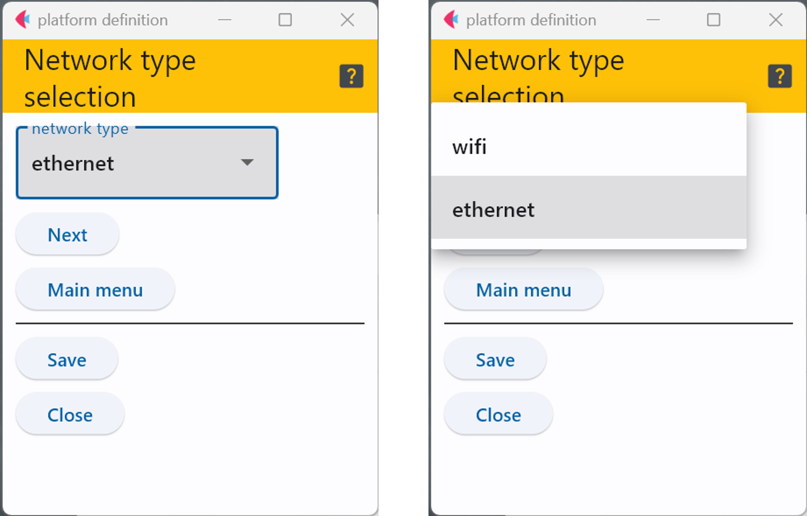

### イーサネットインターフェースのパラメータ
ネットワークインターフェースの種別で``ethernet``を選択した場合は，イーサネットインターフェースのチップセレクト端子の
接続先ピン番号を記入する．

MACアドレスは，classicタイプのイーサネットシールドの場合は裏面にあるもの，MKRファミリの場合は管理者がシールドに
貼ってくれているはずである．


### WiFiパラメータ
ネットワークインターフェースの種別で``wifi``を選んだ場合は，
ここで，接続先のSSIDとパスフレーズを入力する．


### RTCの選択
このページでは，Arduinoに接続しているRTCのICの種類を選択する．
もし，接続しない場合は「``none``」を選択する．

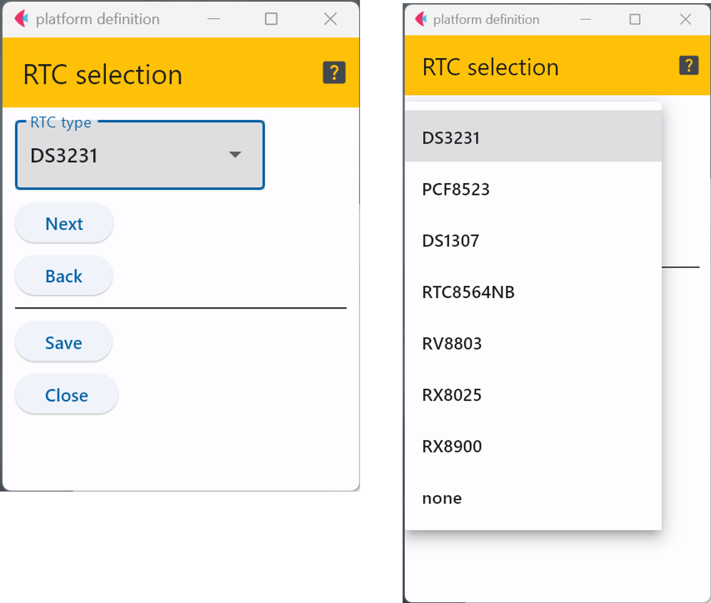


### LED

LEDの設定は2つのページで構成されている．
最初のページ(下図左側)では，動作状況を表示するためのフルカラーLEDを使うか否かを
``yes``もしくは``no``で示す．

``yes``を選択した場合のみ，「Nextボタン」でフルカラーLEDを接続するピン番号や明滅の間隔を表す
パラメータを選択する画面に遷移する．

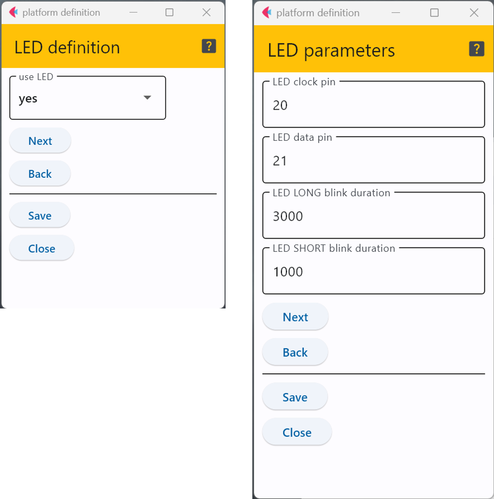

仕様定義ファイルのテンプレートが管理者から配布されたハードウェアに適合したものであれば，
特に変更する必要はないが，独自に作成する場合は，Arduinoのピンの利用条件を考慮して，
割り当てる必要がある．

また，明滅の間隔については，点滅の見た目を微妙に調整したい場合のみ変更すれば良く，
通常は変更する必要はない．

### SD/マイクロSD

このページでは，SDを利用するか否かを選択し(下図左側)，``yes``を選択した場合のみ，SDの
チップセレクト端子を接続するピン番号を定義する．このピン番号は，管理者から配布される
ハードウェアを用いる場合は，指示があるはずだが，自分でハードウェアを用意する場合は
用いる機種やシールドの配線を読んで書き込む必要がある．

注意が必要なのは，MKR Zeroを用いる場合で，この機種は本体にマイクロSDの
スロットが存在するが，このピン番号を配線図通りに数字で指定するとうまくいかず，``SDCARD_SS_PIN``と
定数で書く必要がある．


### シリアル通信速度
センサ端末となるArduinoのUSB端子をシリアル通信回線として利用し，
ログを出力する場合の通信速度を選択する(下図右)．
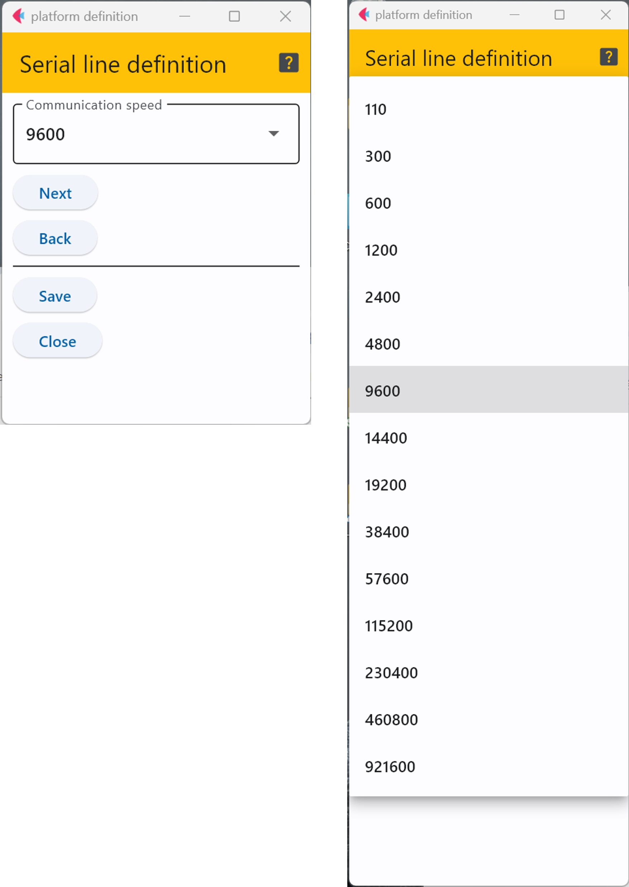


### ログ関連パラメータ
センサ端末の動作ログを出力するか否かの選択(下図左)をし，ファイルもしくは，シリアル(USB端子)に出力する場合は，
ログに含まれるセンサ端末の名前とセンサアプリケーションの名前を定義する(下図中)．

ファイルにログを出力する場合に，SDに保存するログファイルの名前とログファイルの最大サイズを定義する．
もし，ログファイルのサイズがこの定義を超えると，ログファイルの中身は全て消去され，新たに作り直される．

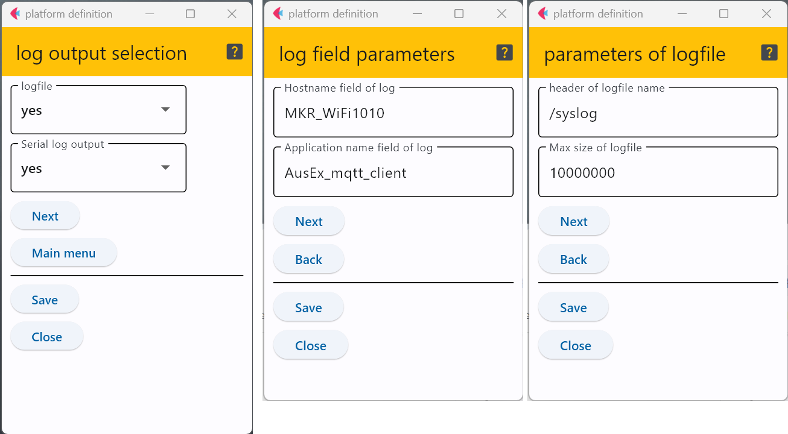


## ネットワーク関連設定

### DHCP利用
このページでは，TCP/IPアドレスの設定にDHCP(Dynamic host configuration protocol)を使うか否かを選択する．

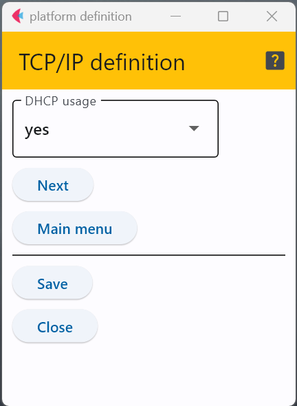


### 手動IP設定
TCP/IPのアドレス設定に，DHCPを用いない場合は，この画面に遷移する．
下図左側でセンサ端末(Arduino)自体のIPアドレスとネットワークマスクの値を設定し，
次のページ(下図右側)でルータとなるIoTゲートウェイのアドレスとDNSサーバのアドレス(通常はIoTゲートウェイが兼任する)を
入力する．

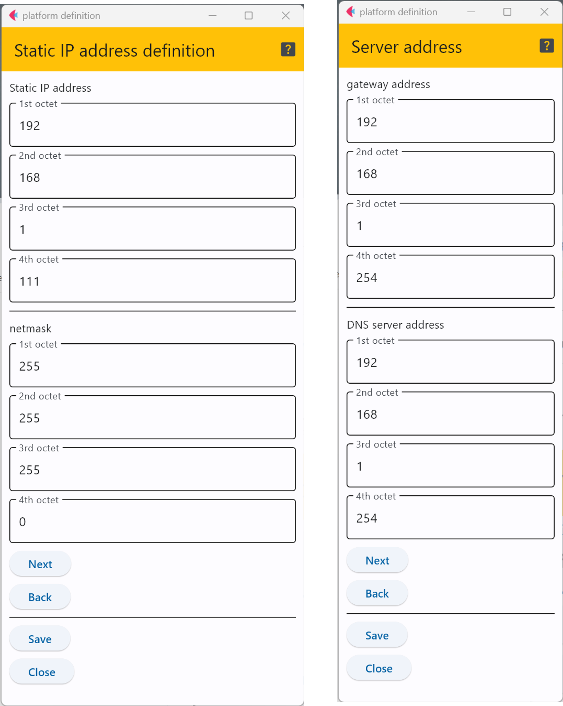


### MQTTパラメータ
下図の2つのページでMQTTに関するパラメータを定義する．
最初に，MQTTで送信するセンサデータのフォーマットで，選択できるフォーマットは以下の3種類．
- plain text
- JSON
- syslog形式

次に，MQTTでメッセージを分類するために必要なキーワードである「topic」．

3つめが，MQTTのサーバ(MQTTブローカー)が動作するIPアドレスとポート番号．
このMQTTブローカーは通常，IoTゲートウェイで動作するため，IoTゲートウェイの
アドレスを入れれば良い．もし，異なるホストでMQTTブローカーを動作させている
場合はIoTネットワークの管理者から指示があるはずである．また，下図のポート番号は，
MQTTブローカーのデフォルトのポート番号であるため，異なる場合は管理者から指示がある
はずである．

最後がMQTTの接続で認証を行うか否かを示す選択肢で，これについては管理者から指示があるはずである．

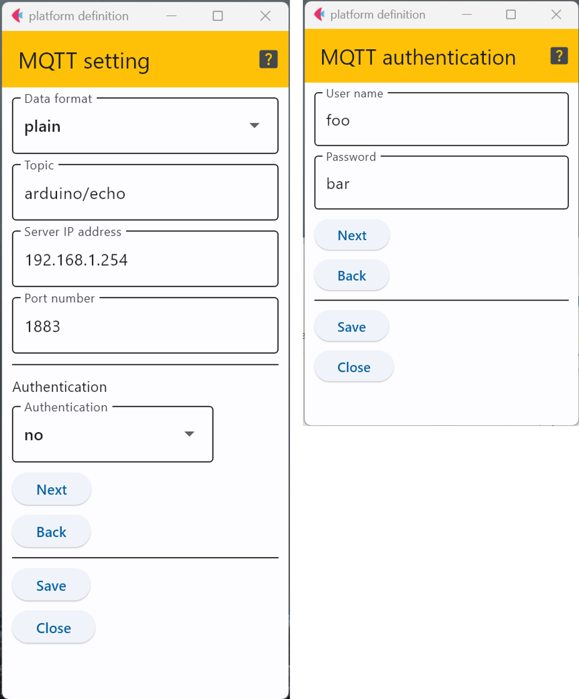

上図右は，MQTTの認証の選択肢で``yes``を選択した場合に表示される．ここでは，MQTT認証で
用いるユーザ名とパスフレーズを入力する．
パスフレーズもユーザ名も平文で入力する必要がある．

なお，これについては管理者から指示があるはずである．

### NTP
こごでは，作成するセンサ端末でNTPを用いるか否かを設定する．
最初の選択肢は，ログ出力のタイムスタンプにNTPを用いるか否かである．これを``yes``にすると，
毎回NTPで時刻問い合わせが行われることから，あまりおすすめしない．
そのため，本開発環境では，RTCを用いることを推奨している．

次の選択肢は，起動時にRTCの時刻をNTPで更新するか否かである．
こちらも，NTPを用いるため，IoTネットワーク内にNTPサーバを動作させる必要があるため，
管理者からNTPに関する情報が提供されなければ，これを有効にすることはできない．

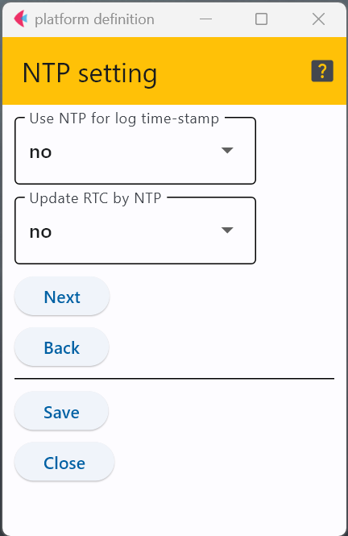

## その他
ここでは，上記の分類に含めることができない，各種の設定を行う．
### Watch Dog Timer
ここではWatch Dog Timer(WDT)について定義する．
最初が下図左側のページでWDTを使うか否かを設定する．

WDTを有効にした場合，次のページで下図右側のパラメータ設定画面が表示される．
これは，Arduinoが無反応になったか否かを判定するためのものであり，
通常は変更する必要がない．

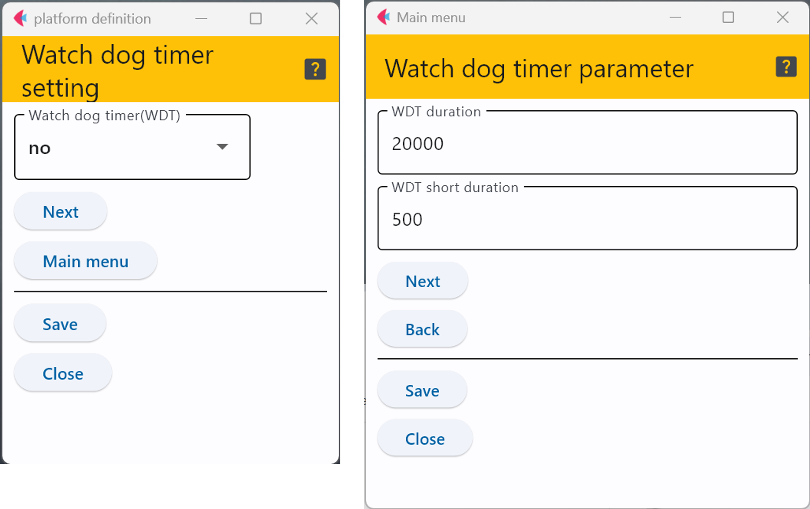


### センサ測定間隔
本開発環境で生成されるArduinoのソフトウェア(スケッチ)では，センサの測定が終了した後，
一旦休止し，その後再度測定に入る．

下図左側の画面では，上記の休止する時間をミリ秒単位で定義する．また，休止期間中に
MCUを省電力モードに設定するか否かを選択する．

省電力モードを有効にすると，次に，複数ある省電力モードの中から何を採用するかを
選択する画面(下図の中)に遷移する．

現在選択可能な省電力モードは下図右側に表示されているモード一覧の中から選択する．
このモードはMCUの種類によって異なるため，詳細はこの[ライブラリ](https://github.com/houtbrion/UniSleep)の
ドキュメントを参照すること．
単純には，メニューの上から下に行くほど消費電力が削減できる．

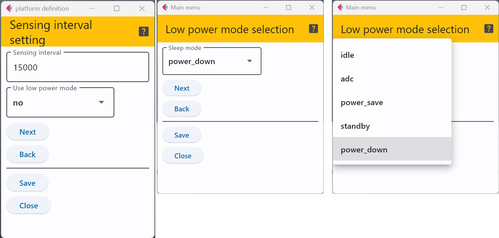

## 環境センサ
この画面では，温湿度センサや気圧センサなど環境を測定するセンサのうち，どれを利用するかを選択する画面である．
ここでは，実際にArduinoに接続するセンサのみを``yes``に設定する．

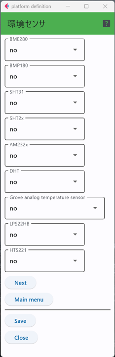

各センサで測定できるデータや利用するインターフェース等は以下の表の通り．
下の表を参考に，必要なセンサのみを有効にする．

|センサ名|温度|湿度|気圧|インターフェース|Groveコネクタ|
|---|---|---|---|---|---|
|[BME280](sensors/BME280.md)|◯|◯|◯|I2C|△|
|[BMP180](sensors/BMP180.md)|✕|✕|◯|I2C|◯|
|[SHT31](sensors/SHT31.md)|◯|◯|✕|I2C|△|
|[SHT2X](sensors/SHT2x.md)|◯|◯|✕|I2C|△|
|[AM232X](sensors/AM232X.md)|◯|◯|✕|I2C|△|
|[DHT](sensors/DHT.md)|◯|◯|✕|デジタル✕1|◯|
|[Grove - Temperature Sensor](sensors/Grove_Thermistor.md)|◯|✕|✕|アナログ✕1|◯|
|[LPS22HB](sensors/LPS22HB.md)|✕|✕|◯|I2C|✕|
|[HTS221](sensors/HTS221.md)|◯|◯|✕|I2C|✕|

### Groveコネクタ
- ◯ Grove用のケーブルで直接接続可能
- △ 変換ケーブルで接続する必要がある
- ✕ ジャンパケーブルで配線する必要がある


## 振動センサ，加速度センサ，ジャイロ

この画面では，振動センサ，加速度センサ，ジャイロのうち，どれを利用するかを選択する画面である．
ここでは，実際にArduinoに接続するセンサのみを``yes``に設定する．

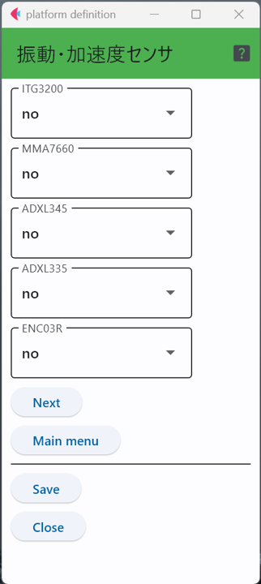

各センサで測定できるデータや利用するインターフェース等は以下の表の通り．
下の表を参考に，必要なセンサのみを有効にする．

|センサ名|加速度(軸数)|ジャイロ(軸数)|インターフェース|Groveコネクタ|
|---|---|---|---|---|
|[ITG3200](sensors/ITG3200.md)|✕|3|I2C|◯|
|[MMA7660](sensors/MMA7660.md)|3|✕|I2C|◯|
|[ADXL345](sensors/ADXL345.md)|3|✕|I2C|◯|
|[ADXL335](sensors/ADXL335.md)|3|✕|アナログ✕3|✕|
|[村田ENC03R](sensors/ENC03R.md)|✕|1|アナログ✕1|◯|

## Groveコネクタ
- ◯ Grove用のケーブルで直接接続可能
- △ 変換ケーブルで接続する必要がある
- ✕ ジャンパケーブルで配線する必要がある

## 対人センサ

この画面では，人感センサ(PIRセンサ)やタッチセンサなど人を対象にしたもののうち，どれを利用するかを選択する画面である．
ここでは，実際にArduinoに接続するセンサのみを``yes``に設定する．


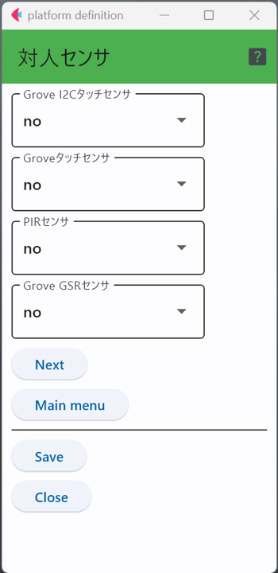

各センサで測定できるデータや利用するインターフェース等は以下の表の通り．
下の表を参考に，必要なセンサのみを有効にする．

|センサ名|接触|人感(赤外線)|インターフェース|Groveコネクタ|
|---|---|---|---|---|
|[GROVE - I2C タッチセンサ(MPR121)](sensors/GroveI2cTouch.md)|12(最大)|✕|I2C|◯|
|[Grove - Touch Sensor](sensors/DigitalTouchSensor.md)|1|✕|デジタル✕1|◯|
|[Grove - PIR Motion Sensor](sensors/PIR_Sensor.md)|✕|◯|デジタル✕1|◯|
|[Grove - GSR Sensor](sensors/Grove_GSR.md)|体(手)の湿り気(汗)|✕|アナログ✕1|◯|

## Groveコネクタ
- ◯ Grove用のケーブルで直接接続可能
- △ 変換ケーブルで接続する必要がある
- ✕ ジャンパケーブルで配線する必要がある


## 視覚関連センサ

この画面では，色覚センサや照度センサのうち，どれを利用するかを選択する画面である．
ここでは，実際にArduinoに接続するセンサのみを``yes``に設定する．

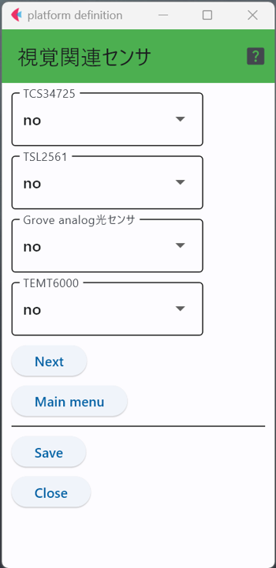

各センサで測定できるデータや利用するインターフェース等は以下の表の通り．
下の表を参考に，必要なセンサのみを有効にする．

|センサ名|照度|色彩|インターフェース|Groveコネクタ|
|---|---|---|---|---|
|[TCS34725](sensors/TCS34725.md)|✕|◯|I2C|△|
|[TSL2561](sensors/TSL2561.md)|◯|✕|I2C|△|
|[Grove - Light Sensor](sensors/Grove_Analog_Light.md)|光の強弱(照度ではない)|✕|アナログ✕1|◯|
|[TEMT6000](sensors/TEMT6000.md)|◯|✕|アナログ✕1|△|

## Groveコネクタ
- ◯ Grove用のケーブルで直接接続可能
- △ 変換ケーブルで接続する必要がある
- ✕ ジャンパケーブルで配線する必要がある

## その他のセンサ

この画面では，上記の分類に収まらない各種のセンサの，どれを利用するかを選択する画面である．
ここでは，実際にArduinoに接続するセンサのみを``yes``に設定する．

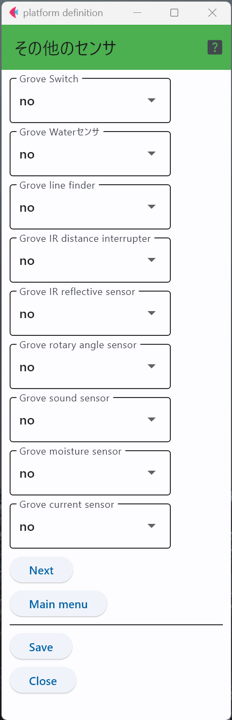

各センサで測定できるデータや利用するインターフェース等は以下の表の通り．
下の表を参考に，必要なセンサのみを有効にする．

|センサ名|観測/測定対象|インターフェース|Groveコネクタ|
|---|---|---|---|
|[Grove - Switch](sensors/DigitalSwitch.md)|物理的な切り替え(スイッチ等)|デジタル✕1|◯|
|[Grove - Water Sensor](sensors/Grove_Water.md)|水の検知(端子間の短絡)|デジタル✕1|◯|
|[Grove - Line Finder](sensors/GroveLineFinder.md)|黒色の検出(赤外線反射)|デジタル✕1|◯|
|[Grove IR Distance Interrupter](sensors/Grove_IR_Distance_Interrupter.md)|物体検出(赤外線反射)|デジタル✕1|◯|
|[Grove - Infrared Reflective Sensor](sensors/Grove_IR_Refrective_Sensor.md)|物体検出(赤外線反射)|デジタル✕1|◯|
|[Grove - Rotary Angle Sensor](sensors/Rotary_Angle.md)|回転角度|アナログ✕1|◯|
|[Grove - Sound Sensor](sensors/Grove_Analog_Sound.md)|音の大小(デジタル値ではない)|アナログ✕1|◯|
|[Grove水分センサー](sensors/Grove_Moisture.md)|土の湿り気|アナログ✕1|◯|
|[Grove電流センサ](sensors/Grove_Current.md)|電流の強弱(正確な値ではない)|アナログ✕1|◯|

## Groveコネクタ
- ◯ Grove用のケーブルで直接接続可能
- △ 変換ケーブルで接続する必要がある
- ✕ ジャンパケーブルで配線する必要がある

***
- [仕様のチェック](checkConfig.md)
- [マニュアルトップに戻る](../Manual.md)
