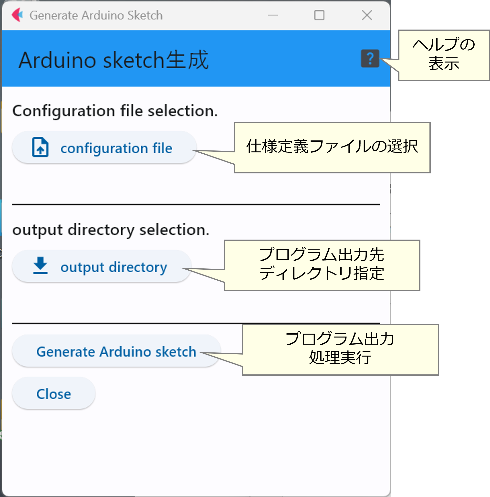

# Arduinoスケッチ(プログラム)の生成 : ``genSketch.py``

Arduinoにインストールするスケッチを生成するプログラムが``genSketch.py``である．
このプログラムを実行すると，下図のような画面が表示される．

ここで，先程編集した仕様定義のyamlファイルを「``config file``」ボタンで選択し，
「``output directory``」ボタンでスケッチを出力するディレクトリを選ぶ．

最後に，「``Create Arduino sketch``」ボタンで生成を実行となる．

先程選択したスケッチ出力先のディレクトリに「``AusEx_MqttClient``」という
ディレクトリができており．``AusEx_MqttClient.ino``というファイルやいくつかの
C++のプログラムが含まれているはずである．

***
- [「スケッチのインストール」に進む](Install.md)
- [「仕様定義ファイルのチェック」に戻る](checkConfig.md)
- [マニュアルトップに戻る](../Manual.md)

