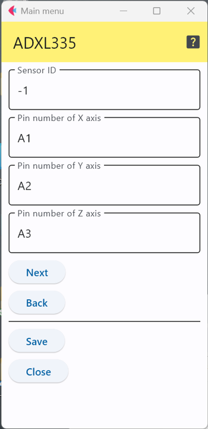

# ADXL335 3軸加速度センサ

アナログ・デバイセズ社の3軸加速度センサ ADXL335は±3gの範囲の加速度を測定できる3軸加速度センサである．

このICを使ったセンサモジュールには以下のようなものがある．

- Grove - 3-Axis Analog Accelerometer https://wiki.seeedstudio.com/Grove-3-Axis_Analog_Accelerometer/

## 設定項目

### 接続端子の指定

3軸の各データ端子をどのアナログ端子に接続するかの値をアナログ端子の番号で指定する．

### センサID
この数字を変更することで，多数のセンサが交じる環境で，このセンサのデータを特定することが可能．

***

- [「仕様定義ファイルの作成」に戻る](../editConfig.md)
