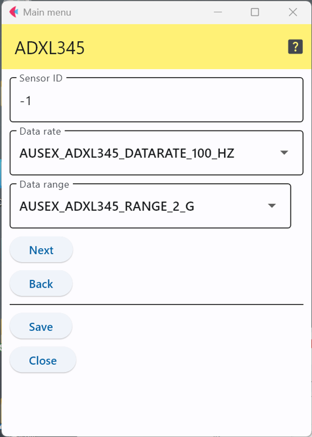

# ADXL345 3軸加速度センサ

アナログ・デバイセズ社の3軸加速度センサ ADXL345はI2CとSPIの2種類のインターフェースをサポートし，
16gまで測定可能なセンサICである．

このICを使ったセンサモジュールには以下のようなものがある．

- [Grove - 3 Axis Digital Accelerometer(±16g)](https://wiki.seeedstudio.com/Grove-3-Axis_Digital_Accelerometer-16g/)
- [SparkFun Triple Axis Accelerometer Breakout - ADXL345](https://www.sparkfun.com/products/9836)


## 設定項目


<div style="text-align: center;">

</div>


### センサID
この数字を変更することで，多数のセンサが交じる環境で，このセンサのデータを特定することが可能．


### パラメータ

```data rate```はどの程度の期間の値を出力するかを設定するパラメータで以下の値を取り得る．
|設定内容|測定周周波数(期間)|
|---|---|
|AUSEX_ADXL345_DATARATE_3200_HZ|3200Hz(1/3200秒)|
|AUSEX_ADXL345_DATARATE_1600_HZ|1600Hz|
|AUSEX_ADXL345_DATARATE_800_HZ|800Hz|
|AUSEX_ADXL345_DATARATE_400_HZ|400Hz|
|AUSEX_ADXL345_DATARATE_200_HZ|200Hz|
|AUSEX_ADXL345_DATARATE_100_HZ|100Hz|
|AUSEX_ADXL345_DATARATE_50_HZ|50Hz|
|AUSEX_ADXL345_DATARATE_25_HZ|25Hz|
|AUSEX_ADXL345_DATARATE_12_5_HZ|12.5Hz|
|AUSEX_ADXL345_DATARATE_6_25HZ|6.25Hz|
|AUSEX_ADXL345_DATARATE_3_13_HZ|3.13Hz|
|AUSEX_ADXL345_DATARATE_1_56_HZ|1.56Hz|
|AUSEX_ADXL345_DATARATE_0_78_HZ|0.78Hz|
|AUSEX_ADXL345_DATARATE_0_39_HZ|0.39Hz|
|AUSEX_ADXL345_DATARATE_0_20_HZ|0.20Hz|
|AUSEX_ADXL345_DATARATE_0_10_HZ|0.10Hz|

また，```range```は加速度の測定範囲(最大値)を指定するパラメータである．
設定可能な値は以下の4種類．

|設定内容|測定範囲|
|---|---|
|AUSEX_ADXL345_RANGE_2_G|±2G|
|AUSEX_ADXL345_RANGE_4_G|±4G|
|AUSEX_ADXL345_RANGE_8_G|±8G|
|AUSEX_ADXL345_RANGE_16_G|±16G|


***

- [「仕様定義ファイルの作成」に戻る](../editConfig.md)
