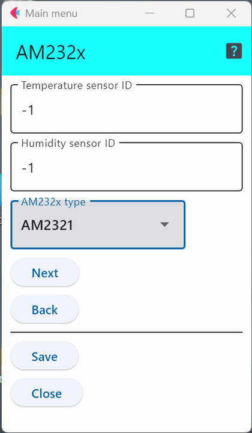

# AM232Xシリーズ温湿度計

この温湿度センサチップを利用した代表的なセンサ製品には以下のようなものがある．

- AM2322 : https://akizukidenshi.com/catalog/g/gM-10880/

AM232Xシリーズのセンサは，独自プロトコルとI2Cの両方をサポートしているが，本ソフトウェアの環境では，I2Cでの接続のみをサポートしている．

チップ販売元のデータシートはネットでは見つけられなかったが，秋月電子が公開しているので，それをまとめたものが以下の表である．

|機種|電源電圧|データシート|
|---|---|---|
|AM2321|2.6-5.5V|https://akizukidenshi.com/download/ds/aosong/AM2321_e.pdf|
|AM2322|3.1-5.5V|https://akizukidenshi.com/download/ds/aosong/AM2322_V1.0.pdf|


## 設定項目
設定すべき項目は3つ存在する．




### センサID

「```Temperature sensor id```」と「```Humidity sensor id```」を用いて，温度,湿度にそれぞれセンサIDを与えることができる．

この設定項目は，利用するセンサに他のセンサと区別するための番号を割り当てる場合のみ値を変更すれば良い．


## センサ種別の選択
本ソフトウェア環境では，AM2321と2322をサポートしているが，センサ接続時に作成したメモを参照して，どのセンサをArduinoに接続したかを記載する．


***

- [「仕様定義ファイルの作成」に戻る](../editConfig.md)