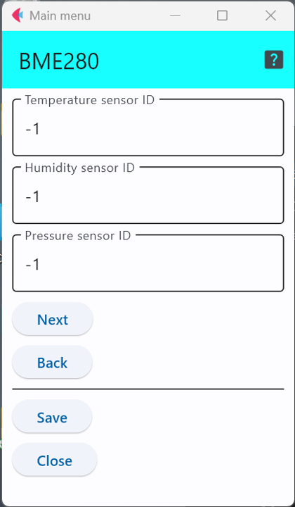

# BME280

Bosch社のBME280というセンサICで，インターフェースとしては，I2CとSPIの両方を利用可能．ただし，本開発環境では，I2Cのみをサポートしている．

このセンサICを利用したセンサモジュールとしては，以下のようなものがある．

- 秋月電子 : https://akizukidenshi.com/catalog/g/gK-09421/
- スイッチサイエンス : https://www.switch-science.com/products/2236


## 設定項目
設定すべき項目は3項目存在する．

<div style="text-align: center;">

</div>


このメニューで設定できる
「```temperature sensor id```」と「```humidity sensor id```」，と「```pressure sensor id```」を用いて，温度,湿度,気圧に別のセンサIDを与えることができる．

この設定項目は，利用するセンサに他のセンサと区別するための番号を割り当てる場合のみ値を変更すれば良い．

***

- [「仕様定義ファイルの作成」に戻る](../editConfig.md)