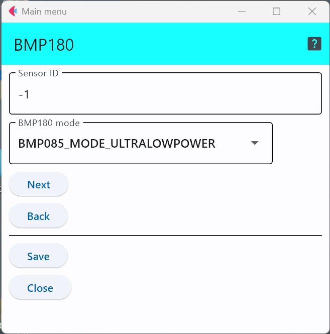

# BMP180 気圧センサ

Bosch社製のI2C接続気圧センサ．このセンサICを利用したセンサモジュールには，以下のようなものがある．

- [Grove - Barometer Sensor (BMP180)](https://wiki.seeedstudio.com/Grove-Barometer_Sensor-BMP180/)

## 設定項目
設定すべき項目は2つ存在する．

### 動作モード

以下は選択可能な動作モードで，消費電力や精度を選択可能．なお，各動作モードの詳細については，ICの[データシート](https://cdn-shop.adafruit.com/datasheets/BST-BMP180-DS000-09.pdf)を参照のこと．
|選択可能な動作モード|
|---|
|BMP085_MODE_ULTRALOWPOWER|
|BMP085_MODE_STANDARD|
|BMP085_MODE_HIGHRES|
|BMP085_MODE_ULTRAHIGHRES|

なお，BMP085は同シリーズの古い型のセンサである．

### センサID
この数字を変更することで，多数のセンサが交じる環境で，このセンサのデータを特定することが可能．

***

- [「仕様定義ファイルの作成」に戻る](../editConfig.md)
