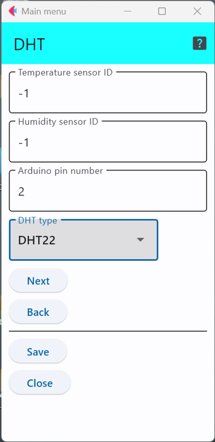

# DHTシリーズ温湿度計

1つのデジタル端子を使い，独自のプロトコルで通信を行う温湿度センサのシリーズ．

このシリーズのセンサを利用した代表的なセンサ製品には以下のようなものがある．

- DHT11 : https://wiki.seeedstudio.com/Grove-TemperatureAndHumidity_Sensor/

- DHT22 : https://wiki.seeedstudio.com/Grove-Temperature_and_Humidity_Sensor_Pro/


## 設定項目
設定すべき項目は3つ存在する．




### センサID

「```Temperature sensor id```」と「```Humidity sensor id```」を用いて，温度,湿度にそれぞれセンサIDを与えることができる．

この設定項目は，利用するセンサに他のセンサと区別するための番号を割り当てる場合のみ値を変更すれば良い．


## 接続するピン番号

ArduinoにDHTを接続したピン番号(デジタル)をそのまま書き込めば良い．


## DHTシリーズのどれを使うか
本ソフトウェアでは，DHT11, DHT21, DHT22の3種類に対応している．
この欄の選択肢は，手元のセンサに合わせる．

***
- [「仕様定義ファイルの作成」に戻る](../editConfig.md)
