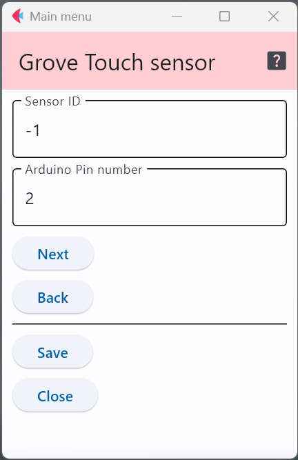

# Groveタッチセンサ

1つのデジタル端子を使い，人が触れているか否かを判別するためのセンサである．

- Grove - Touch Sensor https://wiki.seeedstudio.com/Grove-Touch_Sensor/

## 設定項目

### センサID

この設定項目は，利用するスイッチと他のセンサと区別するために番号を割り当てる場合のみ値を変更すれば良い．

### 接続するピン番号

上図の例(デフォルト)は，デジタル端子の2番に接続していることを表している．

下の図はArduino MKRシリーズ用のGroveモジュールを接続するための拡張基板であり，上図の設定値の場合，接続するのは，下図の「D2」端子となる．

[写真出典](https://store-usa.arduino.cc/products/arduino-mkr-connector-carrier-grove-compatible)

***

- [「仕様定義ファイルの作成」に戻る](../editConfig.md)
