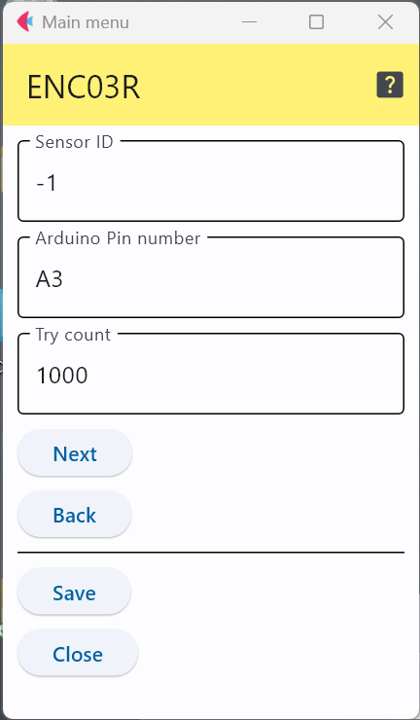

# 村田ENC03R 1軸アナログジャイロ

村田製作所のEND03Rは1軸アナログジャイロである．

このICを使ったセンサモジュールには以下のようなものがある．

- [Grove-Single Axis Analog Gyro](https://wiki.seeedstudio.com/Grove-Single_Axis_Analog_Gyro/)

## 設定項目

### センサID
この数字を変更することで，多数のセンサが交じる環境で，このセンサのデータを特定することが可能．

### 接続端子の指定

上の図の例は，アナログ端子の3番に接続していることを表している．

### パラメータ

ENC03Rを駆動するソフトウェアでは，動作開始時に静かな環境で測定を繰り返し，その平均値を基準の値として用いる．
この基準の値を求めるための測定回数をこのパラメータで指定する．

***

- [「仕様定義ファイルの作成」に戻る](../editConfig.md)
