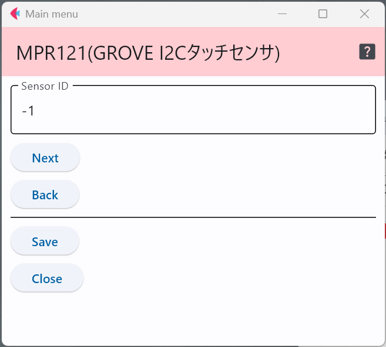

# Grove I2C タッチセンサ

Seeed studio社が販売するセンサで，I2C接続で複数のタッチセンサの値を同時に読み取れるタッチセンサ．製品ページの写真では，4つしかセンサが接続されていないが，8本まで繋ぐコネクタが存在する．さらに，外部に4つセンサを拡張できる端子が基板上に存在している．そのため，ハードを拡張すると最大12個のタッチセンサを接続できる．

- 製品ページ : https://wiki.seeedstudio.com/Grove-I2C_Touch_Sensor/

## 設定項目

センサIDの数字を変更することで，多数のセンサが交じる環境で，このセンサのデータを特定することが可能．

***

- [「仕様定義ファイルの作成」に戻る](../editConfig.md)

