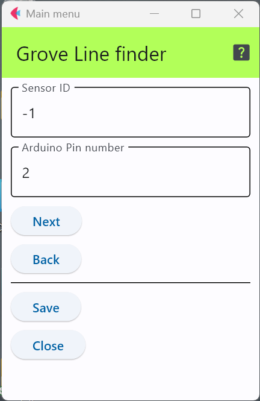

# Grove Line Finder

1つのデジタル端子を使い，紙や地面に描いた黒線を検出するような目的で用いる．

Groveとしてモジュール化されたものも存在する．

- Grove - Line Finder 製品ページ : https://wiki.seeedstudio.com/Grove-Line_Finder/

## 設定項目

### センサID

この設定項目は，利用するスイッチと他のセンサと区別するために番号を割り当てる場合のみ値を変更すれば良い．

## 接続するピン番号
上図は，デジタル端子の2番に接続していることを表している．

下の図はArduino MKRシリーズ用のGroveモジュールを接続するための拡張基板であり，上の設定値の場合，接続するのは，「D2」端子となる．

[写真出典](https://store-usa.arduino.cc/products/arduino-mkr-connector-carrier-grove-compatible)

***

- [「仕様定義ファイルの作成」に戻る](../editConfig.md)
