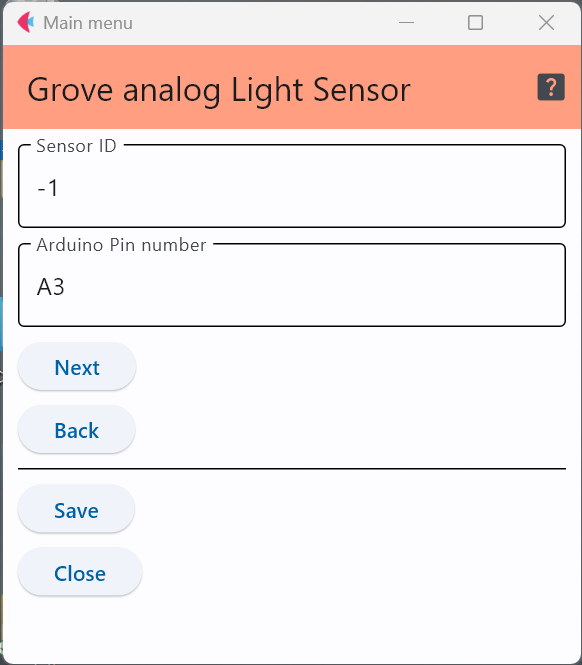

# Grove - Light Sensor

これは，光可変抵抗を使った照度センサで，このGroveモジュールの詳細は以下のWebに記載されている．
光可変抵抗とは，その部品に当たっている光の強さで電気抵抗値が変化する素子である．

- Grove - Light Sensor 製品ページ : https://wiki.seeedstudio.com/Grove-Light_Sensor/

## 設定項目

### センサID
この数字を変更することで，多数のセンサが交じる環境で，このセンサのデータを特定することが可能．

### 接続端子の指定

センサをどのアナログ端子に接続するかを明示する．上の例はアナログ端子の3番に接続していることを
示している．

***

- [「仕様定義ファイルの作成」に戻る](../editConfig.md)
