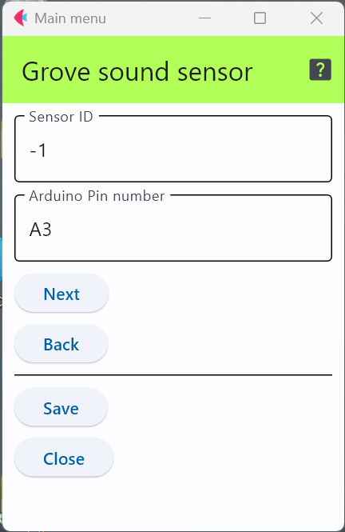

# Grove - Sound Sensor

これは，簡易なマイクから出力される音声信号の強弱で音圧/音量を測定するタイプのセンサでする．

- Grove - Sound Sensor 製品ページ :  https://wiki.seeedstudio.com/Grove-Sound_Sensor/

## 設定項目

### センサID
この数字を変更することで，多数のセンサが交じる環境で，このセンサのデータを特定することが可能．

### 接続端子の指定
センサをどのアナログ端子に接続するかを明示する．

上図の例はアナログ端子の3番に接続していることを示している．

***

- [「仕様定義ファイルの作成」に戻る](../editConfig.md)
