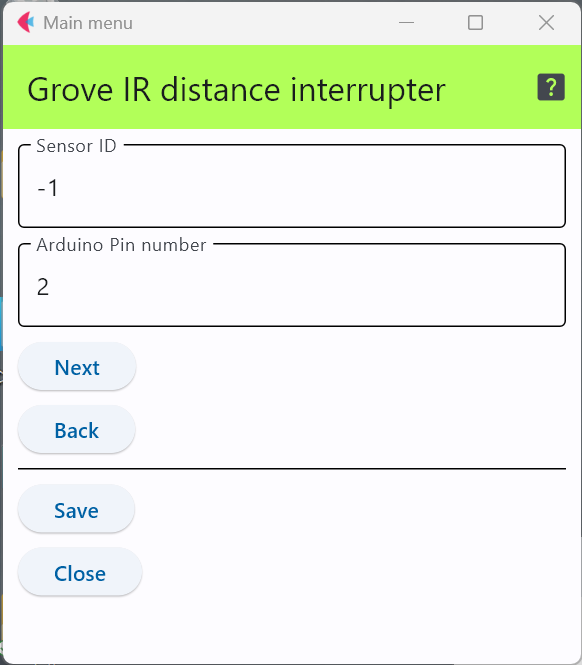

# Grove IR Distance Interrupter

1つのデジタル端子を使い，センサの前9cm～30cm程度の範囲に物体が置かれ，赤外線を反射すれば，それを検出するセンサである．

- Grove - IR Distance Interrupter https://wiki.seeedstudio.com/Grove-IR_Distance_Interrupter_v1.2/

## 設定項目

### センサID

この設定項目は，利用するスイッチと他のセンサと区別するために番号を割り当てる場合のみ値を変更すれば良い．

### 接続するピン番号

上の図は，デジタル端子の2番に接続していることを表している．

下の図はArduino MKRシリーズ用のGroveモジュールを接続するための拡張基板であり，上の設定値の場合，接続するのは，「D2」端子となる．

[写真出典](https://store-usa.arduino.cc/products/arduino-mkr-connector-carrier-grove-compatible)

***

- [「仕様定義ファイルの作成」に戻る](../editConfig.md)