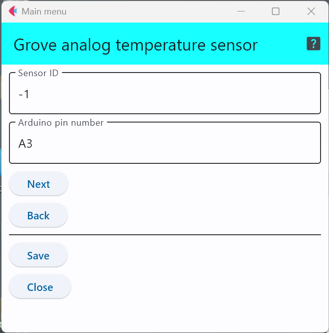

# Grove - Temperature Sensor 

これは，サーミスタを使った温度センサで，このGroveモジュールの詳細は以下のWebに記載されている．
なお，サーミスタとは，温度で抵抗値が変化する電気抵抗である．

- Grove - Temperature Sensor https://wiki.seeedstudio.com/Grove-Temperature_Sensor_V1.2/

## 設定項目
設定すべき項目は2つ存在する．

## センサID
この数字を変更することで，多数のセンサが交じる環境で，このセンサのデータを特定することが可能．

## 接続端子の指定
センサをどのアナログ端子に接続するかを明示するが指定方法は「``A``と``数字``」の組み合わせで
アナログ端子を示す．

上の図はアナログ端子の3番に接続していることを示している．

***
- [「仕様定義ファイルの作成」に戻る](../editConfig.md)