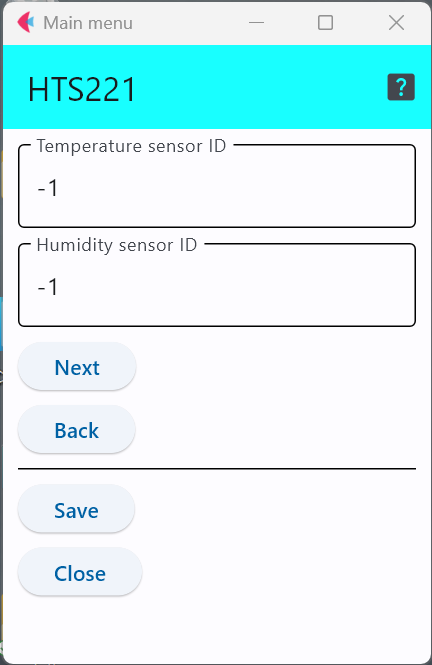

# HTS221

STマイクロ社の[HTS221](https://www.st.com/ja/mems-and-sensors/hts221.html)という温湿度センサICで，インターフェースとしては，I2CとSPIの両方を利用可能．ただし，本開発環境では，I2Cのみをサポートしている．

このセンサICを利用したセンサモジュールとしては，以下のようなものがある．

- Adafruit  https://www.adafruit.com/product/4535
- Arduino MKR ENV Shield rev2 https://store.arduino.cc/products/arduino-mkr-env-shield-rev2

なお，動作電圧は1.7Vから3.6Vであるため，5Vで動作するArduino Uno等では使えません．

## 設定項目

「``Temperature sensor id``」と「``Humidity sensor id``」を用いて，温度,湿度にそれぞれセンサIDを与えることができる．

この設定項目は，利用するセンサに他のセンサと区別するための番号を割り当てる場合のみ値を変更すれば良い．

***

- [「仕様定義ファイルの作成」に戻る](../editConfig.md)