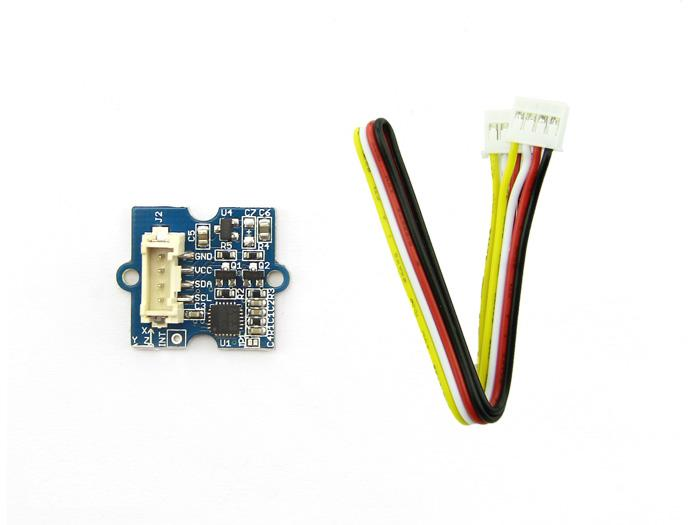
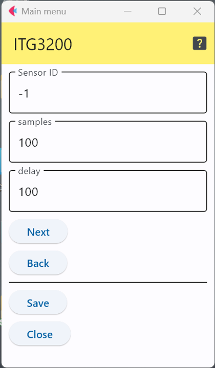

# ITG3200ジャイロセンサ

I2C接続で利用するTDK社製の3次元ジャイロセンサ．このセンサICを利用したセンサモジュールには，以下のようなものがある．

- [Grove 三軸デジタルジャイロ](https://jp.seeedstudio.com/Grove-3-Axis-Digital-Gyro.html)

なお，チップの製品情報は以下のURLから取得可能
- https://product.tdk.com/ja/search/sensor/mortion-inertial/gyro/info?part_no=ITG-3200

## 設定項目

設定すべき項目は2種類存在する．

### キャリブレーション
このICは動作開始直後にキャリブレーションを行う必要がある．キャリブレーションでは，
測定はある程度の時間の測定を複数回行うため，1回の測定時間(ミリ秒)と繰り返し回数を指定する．

### センサID
この数字を変更することで，多数のセンサが交じる環境で，このセンサのデータを特定することが可能．

***

- [「仕様定義ファイルの作成」に戻る](../editConfig.md)
