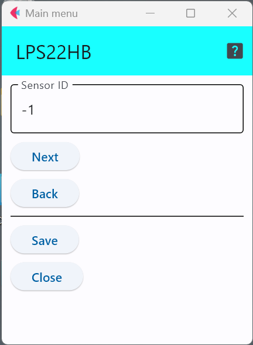

# LPS22HB

STマイクロ社の[LPS22HB](https://www.st.com/ja/mems-and-sensors/lps22hb.html)という気圧センサICである．

このセンサICを利用したセンサモジュールとしては，以下のようなものがある．

- Adafruit  https://www.adafruit.com/product/4633
- ストロベリーリナックス https://www.switch-science.com/products/2236
- Arduino MKR ENV Shield rev2 https://store.arduino.cc/products/arduino-mkr-env-shield-rev2

なお，動作電圧は1.7Vから3.6Vであるため，5Vで動作するArduino Uno等では使えません．

## 設定項目

設定すべき項目はセンサIDのみである．
この数字を変更することで，多数のセンサが交じる環境で，このセンサのデータを特定することが可能．

***

- [「仕様定義ファイルの作成」に戻る](../editConfig.md)
