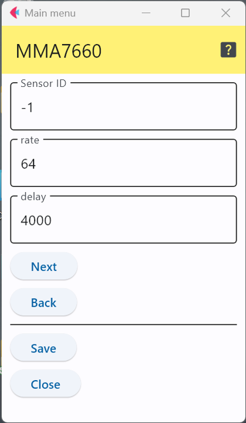

# MMA7660 - 3次元加速度センサ

MMA7660はNXPセミコンダクタ社の3次元加速度センサチップであり，以下のようなモジュールが販売されている．

- Grove - 3-Axis Digital Accelerometer(±1.5g) : https://www.seeedstudio.com/Grove-3-Axis-Digital-Accelerometer-1-5g.html

## 設定項目

### 測定のパラメータ

この加速度センサは，複数回(1秒あたり何回か)の測定を行い，平均値を返す仕様となっている．そのため，測定時に1秒間に何回測定するかを指定するパラメータ``rate``をICに設定し，その後ICの動作が安定するまでに一定時間待ち合わせる必要があるため，その待ち時間を``delay``で指定する．

``rate``として指定可能な値は``120, 64, 32, 16, 8, 4, 2, 1``の8つ．``delay``のデフォルト値はデータシート上の推奨値を採用している．

### センサID

この定義を用いて，センサにIDを付与できるが，他のセンサと区別するために番号を割り当てる必要がある場合のみ値を変更すれば良い．

***

- [「仕様定義ファイルの作成」に戻る](../editConfig.md)
