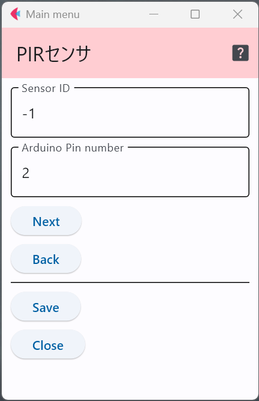

# 人感センサ

トイレなどで，人が入ると電灯がつくような仕組みがあるが，これは人感センサで人の動きを検出して，電灯のON/OFFを制御している．
Passive Infra-Redを縮めて，PIRセンサとも呼ばれる．

このセンサの特徴は，受信した赤外線に変動があった場合のみ，「何かを検出した」と出力するため，人や動物が
ジッとしていると検出できなくなる．

以下は，PIRセンサをGrove用のモジュールにしたものである．

- Grove - PIR Motion Sensor https://wiki.seeedstudio.com/Grove-PIR_Motion_Sensor/

## 設定項目

### センサID

この設定項目は，利用するスイッチと他のセンサと区別するために番号を割り当てる場合のみ値を変更すれば良い．

### 接続するピン番号

上の図の例は，デジタル端子の2番に接続していることを表している．

下の図はArduino MKRシリーズ用のGroveモジュールを接続するための拡張基板であり，上の設定値の場合，接続するのは，「D2」端子となる．

[写真出典](https://store-usa.arduino.cc/products/arduino-mkr-connector-carrier-grove-compatible)

***

- [「仕様定義ファイルの作成」に戻る](../editConfig.md)
