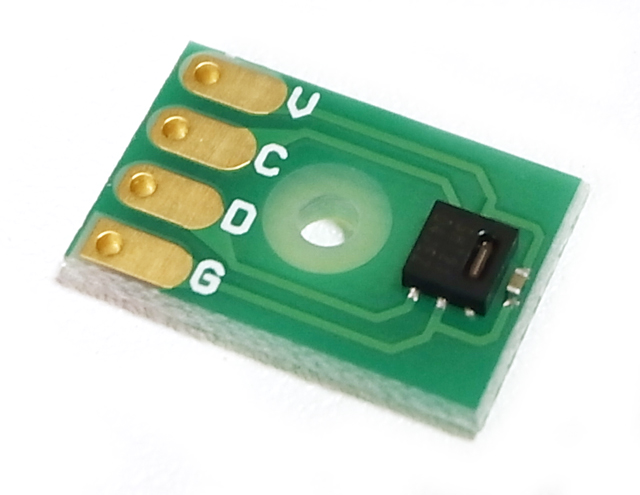
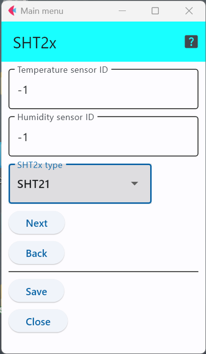

# SHT2x

SENSIRION社の温湿度センサでI2Cインターフェースで接続できます．

- 製品ページ https://www.sensirion.com/search/products?q=SHT2x

このセンサICを利用したセンサモジュールとしては，以下のようなものがある．

- [ストロベリーリナックス SHT21](https://strawberry-linux.com/catalog/items?code=80021)


<div style="text-align: center;">

</div>


SHT2xシリーズのセンサICは3種類存在し，低価格版のSHT20系，標準的な性能のSHT21系，高精度のSHT25系になる．


## 設定項目
設定すべき項目は2項目存在する．


<div style="text-align: center;">

</div>


### センサID

「```Temperature sensor id```」と「```Humidity sensor id```」を用いて，温度,湿度にそれぞれセンサIDを与えることができる．

この設定項目は，利用するセンサに他のセンサと区別するための番号を割り当てる場合のみ値を変更すれば良い．


### センサ種別
SHT21とSHT25が選択可能であるが，

ここは，手元に存在するSHTの型番に合わせたものを選択する．

***

- [「仕様定義ファイルの作成」に戻る](../editConfig.md)