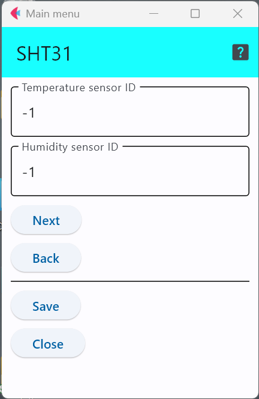

# SHT31

SENSIRION社の温湿度センサでI2Cインターフェースで接続できます．

このセンサICを利用したセンサモジュールとしては，以下のようなものがある．

- 秋月電子 : https://akizukidenshi.com/catalog/g/gK-12125/

## 設定項目
設定すべき項目は2項目存在する．

「``Temperature sensor id``」と「``Humidity sensor id``」を用いて，温度,湿度にそれぞれセンサIDを与えることができる．

この設定項目は，利用するセンサに他のセンサと区別するための番号を割り当てる場合のみ値を変更すれば良い．

***

- [「仕様定義ファイルの作成」に戻る](../editConfig.md)