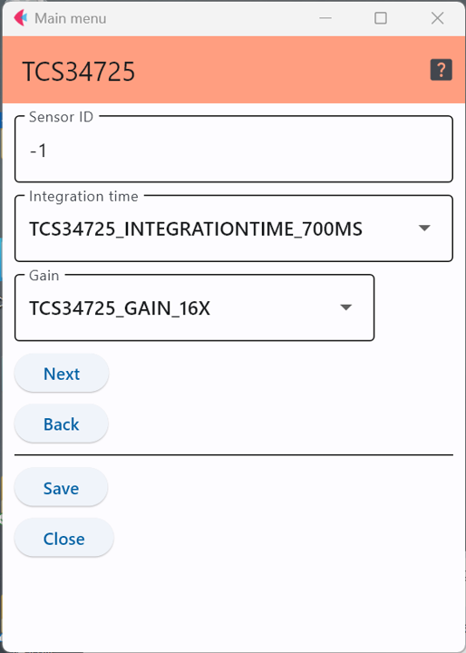

# TCS34725 RGB color sensor

TCS34725は色を検知するセンサであり，以下のようなモジュールが販売されている．

- [Adafruit RGB Color Sensor with IR filter and White LED - TCS34725](https://www.adafruit.com/product/1334)


## 設定項目


<div style="text-align: center;">

</div>


### センサID

この定義を用いて，センサにIDを付与できるが，他のセンサと区別するために番号を割り当てる必要がある場合のみ値を変更すれば良い．


### 測定のパラメータ

このセンサチップでは，色の測定に使う時間と，光に対する反応のゲインを設定することができる．

測定時間(integration time)は```integration time```，ゲインは```gain```で指定する．

測定時間で指定できる値は，以下の表の何れか．

|設定値(キーワード)|実際の時間|
|---|---|
|TCS34725_INTEGRATIONTIME_2_4MS|2.4ms|
|TCS34725_INTEGRATIONTIME_24MS|24ms|
|TCS34725_INTEGRATIONTIME_50MS|50ms|
|TCS34725_INTEGRATIONTIME_101MS|101ms|
|TCS34725_INTEGRATIONTIME_154MS|154ms|
|TCS34725_INTEGRATIONTIME_700MS|700ms|

また，ゲインとして指定できる値は以下の4通り．
|設定値(キーワード)|実際の値|
|---|---|
|TCS34725_GAIN_1X|1倍|
|TCS34725_GAIN_4X|4倍|
|TCS34725_GAIN_16X|16倍|
|TCS34725_GAIN_60X|60倍|


***

- [「仕様定義ファイルの作成」に戻る](../editConfig.md)
