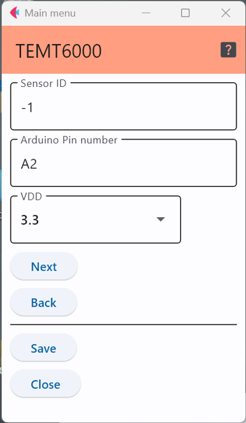

# TEMT6000

Vishay社の照度センサで，このセンサを搭載したセンサモジュールとしては，以下のようなものがある．

- [SparkFun Ambient Light Sensor Breakout - TEMT6000](https://www.sparkfun.com/products/8688)
- [Arduino MKR ENV Shield rev2](https://store.arduino.cc/products/arduino-mkr-env-shield-rev2)

## 設定項目

### センサID
この数字を変更することで，多数のセンサが交じる環境で，このセンサのデータを特定することが可能．

### 接続端子の指定

センサをどのアナログ端子に接続するかを明示する．上図の例はアナログ端子の2番に接続していることを
示している．

### 動作電圧

ここは，このセンサを接続したArduino(もしくはその互換機)の動作電圧を記入する．
選択する値は「3.3」もしくは「5.0」のいずれか．

***

- [「仕様定義ファイルの作成」に戻る](../editConfig.md)
