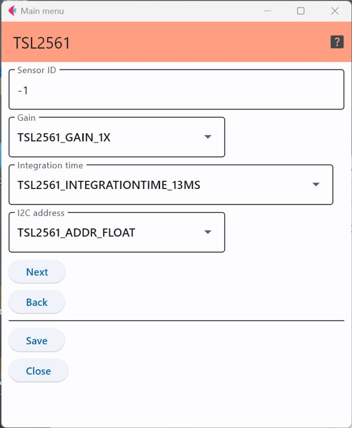

# TSL2561光センサ

TSL2561は照度を測定するセンサで，このICを使ったセンサモジュールには以下のようなものがある．

- [Grove デジタルライトセンサ](https://jp.seeedstudio.com/Grove-Digital-Light-Sensor-TSL2561.html)
- [Adafruit TSL2561 Digital Luminosity/Lux/Light Sensor Breakout](https://www.adafruit.com/product/439)

## 設定項目

### センサID
この数字を変更することで，多数のセンサが交じる環境で，このセンサのデータを特定することが可能．

### パラメータ

インテグレーションタイムはどの程度の期間の値(平均値)を出力するかを設定するパラメータで以下の値を取り得る．
|設定内容|測定周期間|
|---|---|
|TSL2561_INTEGRATIONTIME_13MS|13ミリ秒|
|TSL2561_INTEGRATIONTIME_101MS|101ミリ秒|
|TSL2561_INTEGRATIONTIME_402MS|402ミリ秒|

また，ゲインは加速度の測定範囲(最大値)を指定するパラメータで，2つから選択できる．

|設定内容|測定範囲|
|---|---|
|TSL2561_GAIN_1X|1倍|
|TSL2561_GAIN_16X|16倍|

また，アドレスはセンサのI2Cアドレスであり，このチップは特定の端子の配線状況でI2Cのアドレスが
変化する．Adafruitsのモジュールでは，Addr端子の配線でI2Cのアドレスを決めることができる．

一方，GroveのモジュールはI2Cのアドレスが決め打ちになっている．

|設定内容|回路の状態|
|---|---|
|TSL2561_ADDR_FLOAT|ADDR端子が未配線|
|TSL2561_ADDR_LOW|ADDR端子をGNDに配線|
|TSL2561_ADDR_HIGH|ADDR端子をVDDに配線|

GroveのモジュールはTSL2561_ADDR_LOWを使う必要がある．

***

- [「仕様定義ファイルの作成」に戻る](../editConfig.md)
