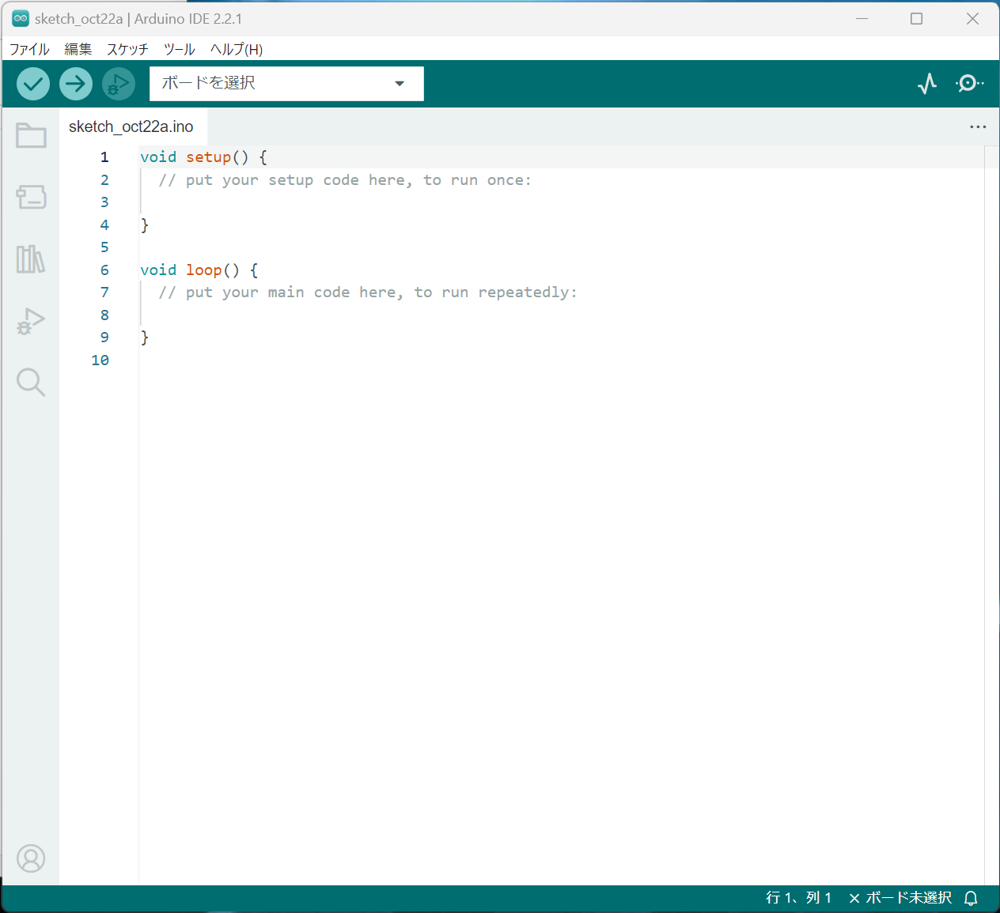
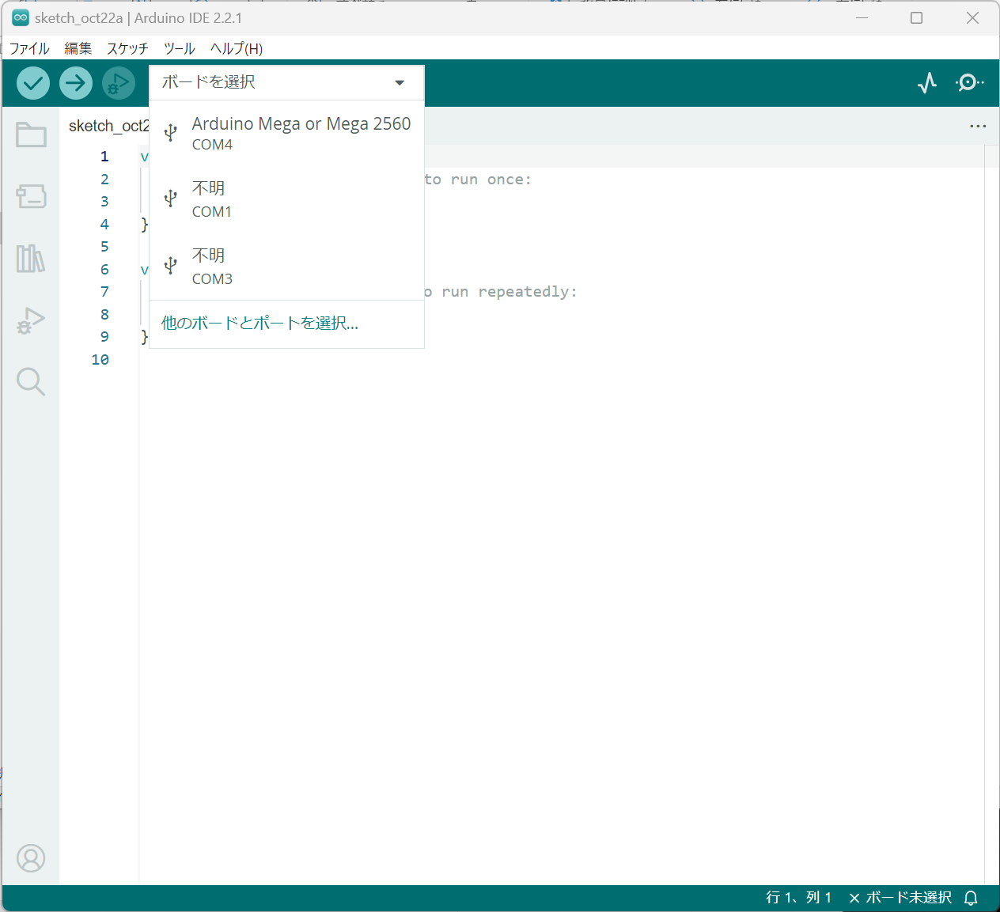
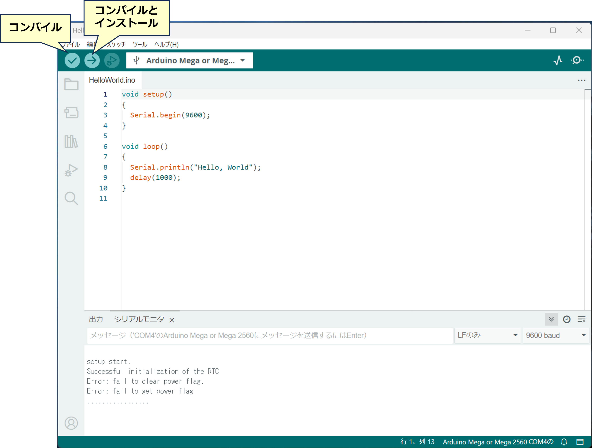
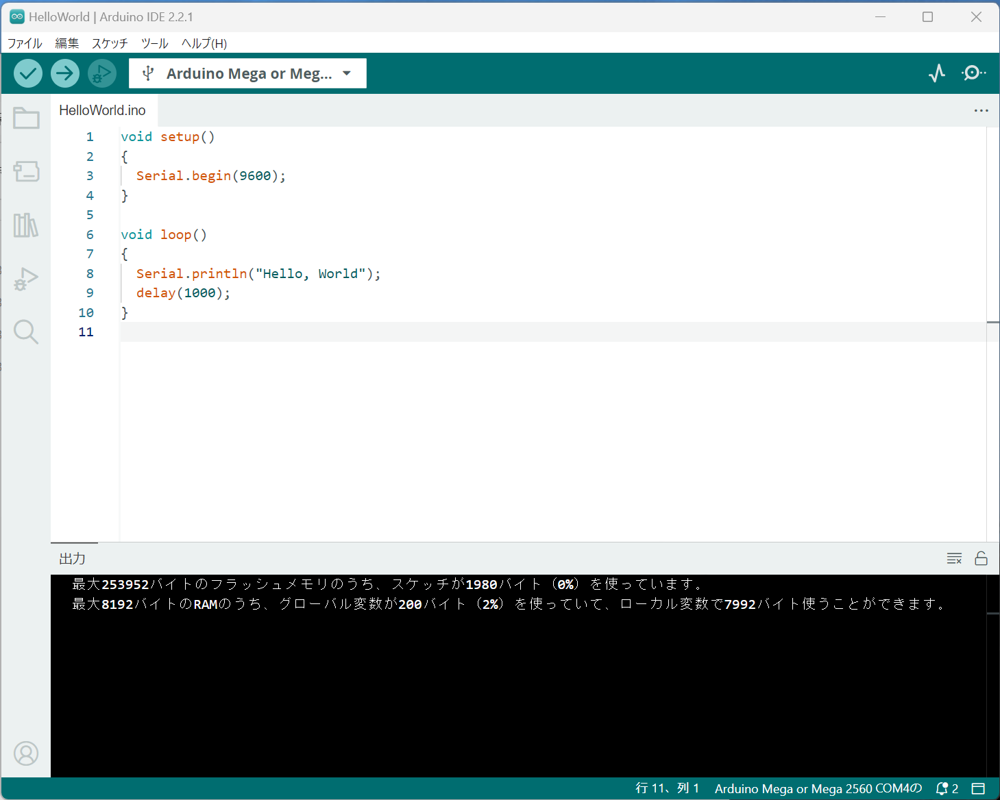

# Arduinoのプログラム(スケッチ)のインストール
ここでは，Arduinoにプログラム(スケッチ)を書き込む方法を説明する．

Arduino IDEはWindows/Mac/Linuxで動作するが，ここではWindowsを例にとる．

## ArduinoとPCの接続
Arduinoにおけるソフトウェア開発は，[Arduino公式サイト](https://www.arduino.cc/)
からArduino IDEをダウンロード&インストールした上で，USBケーブルを用いてPCとArduinoを接続する(一部例外もある)．

すると，デバイスマネージャのポート(COMとLPT)にArduinoが認識される．


この際，Windows用のドライバが提供されない互換機等では，マイコンの名前が表示されず，単なるCOMポートに見えるため，接続前後で変化したCOMポートが何番であるかを確認する必要がある．


## Arduino IDEによるArduinoの選択
次に，Arduino IDEを立ち上げると，下のような初期画面が表示される．



ここで，ボードを選択のメニューをクリックすると，COMポートの一覧がプルダウンメニューに表示されるので，接続したArduinoを選択する．

先に述べたように，互換機では機種名が表示されないとか，間違って似たArduinoのボード名が表示される可能性があるが，この時はCOMポートの名前で判断する．


## プログラム(スケッチ)の書き込み(コンパイルとインストール)

何らかのプログラムをIDE上で入力し，そのプログラムをインストールするためには，
最初にコンパイルボタンでエラーが無いことを確認の上，「コンパイルとインストール」ボタンでインストールまで行う．



コンパイルとインストールに成功すると下の図ような画面に変化する．


Arduinoおよび大部分の互換機では，インストールが成功すると，自動的にリセットがかかり，インストールされたプログラムの実行が開始される．

## 動作の確認

先程インストールしたプログラムは1秒に一回「Hello, World"」と印字するプログラムであるので，「ツール」メニユーの「シリアルモニタ」を選択すると，ArduinoがUSBポートに出力するデータ(今回は文字列)を確認することができる．


下の図のように，「Hello, World」が出力されるのが見えるはずである．
ただし，
自分で行う際には，Arduinoの接続されているCOMポートの通信速度とArduino IDEのCOMポートの通信速度を同じにする等の操作が必要になるが，ここでは，省略する．


文字化けしている場合は，プログラムにある
```
Serial.begin(9600)
```
の9600(通信速度)と，IDEのシリアルモニタの上部にある「LFのみ」の右側「9600 baud」の数字が食い違っているはずである．


***
- [「Pythonインストール」に進む](Pythonインストール.md)
- [「Arduino IDEのライブラリの準備」に戻る](Library.md)
- [マニュアルトップに戻る](../Manual.md)
