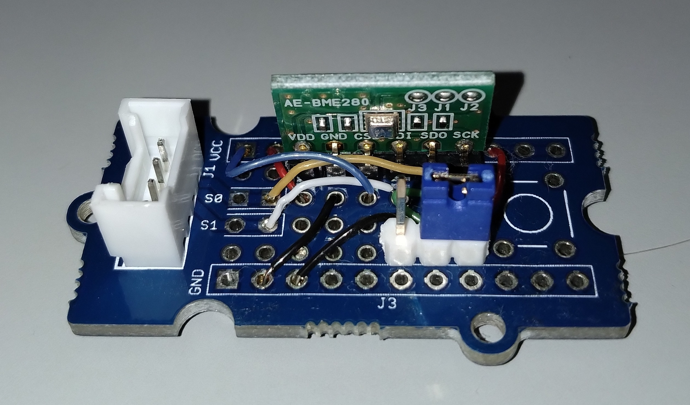
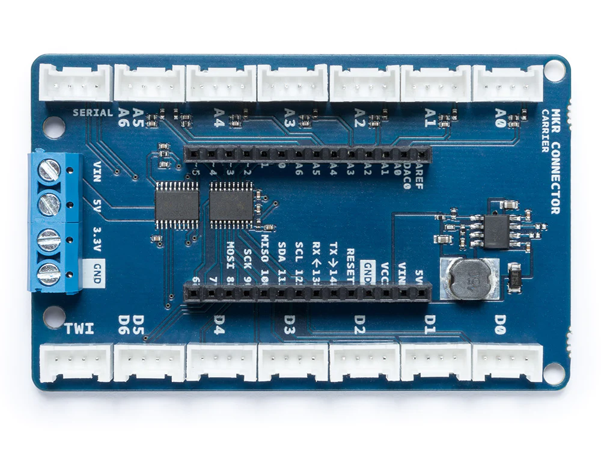

# BME280

Bosch社のBME280というセンサICで，インターフェースとしては，I2CとSPIの両方を利用可能．ただし，本開発環境では，I2Cのみをサポートしている．

このセンサICを利用したセンサモジュールとしては，以下のようなものがある．

- 秋月電子 : https://akizukidenshi.com/catalog/g/gK-09421/
- スイッチサイエンス : https://www.switch-science.com/products/2236

なお，BME280の動作電圧は1.7Vから3.6Vであるため，5Vで動作するArduino Uno等では使えません．

## Arduinoとの接続例
以下の写真は先に紹介した秋月電子のセンサキットをGroveのI2C接続で利用できるようにしたモジュールの例である．

このモジュールはI2C接続となるため，MKRシリーズ用のGrove基板の場合は，「TWI」コネクタと接続する．

- MKRシリーズ用Grove基板 https://store-usa.arduino.cc/products/arduino-mkr-connector-carrier-grove-compatible?selectedStore=us

Uno等のクラシックシリーズ用のGrove基板の場合は，下の写真にも見えているように，「I2C」端子に接続する．
- Unoシリーズ用Grove基板  https://jp.seeedstudio.com/Base-Shield-V2.html 

このモジュールをArduinoと接続すると以下の画像のようになる．

## 接続先の情報

I2Cで接続する機器は特に情報をメモしておく必要はない．

***

- [「センサ端末の詳細定義」に戻る](../SensorSelection.md)