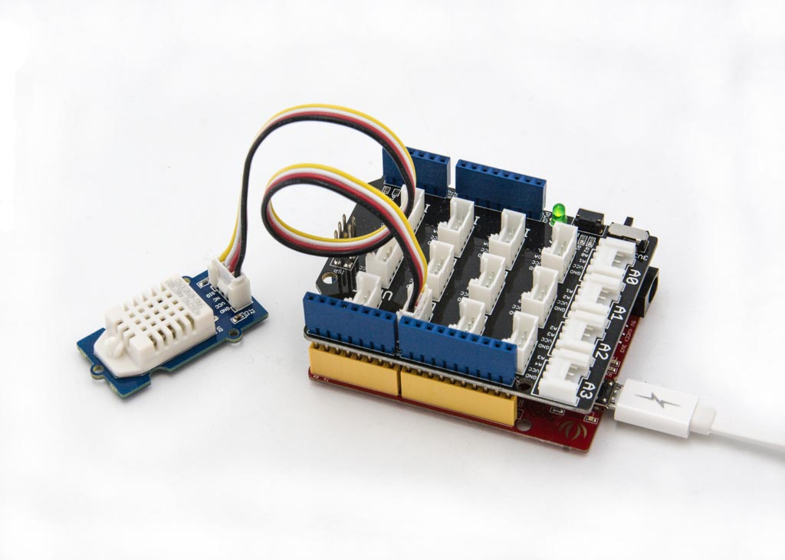

# DHTシリーズ温湿度計

1つのデジタル端子を使い，独自のプロトコルで通信を行う温湿度センサのシリーズ．

このシリーズのセンサを利用した代表的なセンサ製品には以下のようなものがある．

- DHT11 : https://wiki.seeedstudio.com/Grove-TemperatureAndHumidity_Sensor/

- DHT22 : https://wiki.seeedstudio.com/Grove-Temperature_and_Humidity_Sensor_Pro/

上の両センサ共に，3.3V, 5Vの両方で動作可能．

## Arduinoとの接続例
DHTシリーズのセンサは，デジタル端子1つに接続する必要があるため，Groveの端子に接続できるモジュールを用いる場合は，ケーブル1本で何れかのデジタル端子に接続すれば良い．

[写真出典](https://wiki.seeedstudio.com/Grove-Temperature_and_Humidity_Sensor_Pro/)

## 接続先の情報

DHTシリーズ(DHT11,21,22)のうち，どのセンサを使っているか，デジタル端子(D0,D1...)のうち，どの端子(コネクタ)に
接続したかをメモしておくこと．

***

- [「センサ端末の詳細定義」に戻る](../SensorSelection.md)

