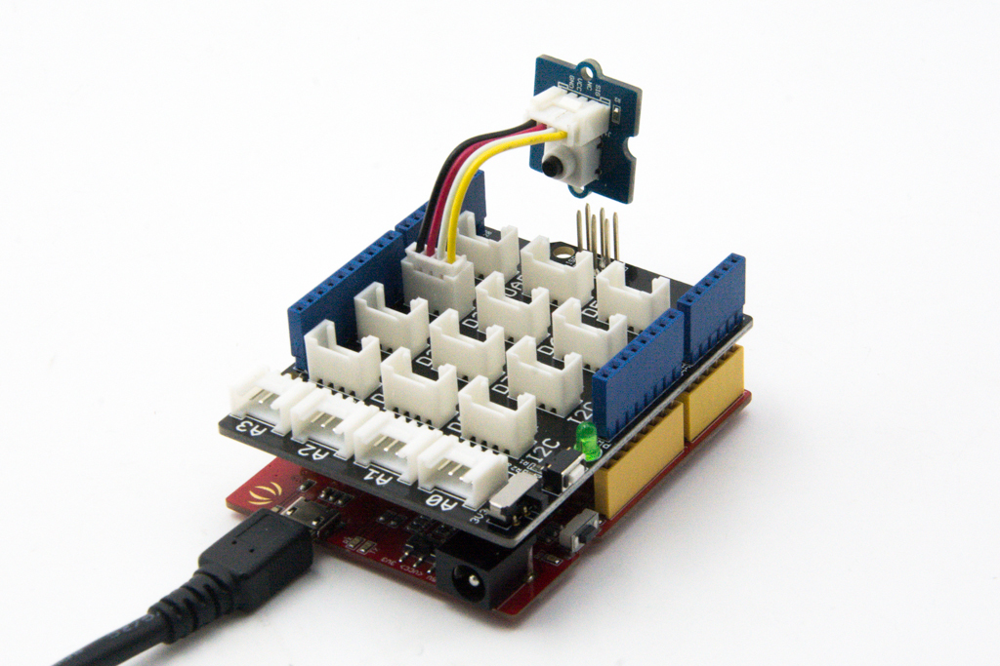

# デジタルスイッチ

1つのデジタル端子を使い，スイッチのON/OFFで端子の電圧が変化することを読み取るものである．

Groveとしてモジュール化されたものも存在する．

- Grove - Button https://wiki.seeedstudio.com/Grove-Button/
- Grove - Switch https://wiki.seeedstudio.com/Grove-Switch-P/

単なるスイッチなので，動作電圧に制限はない．

また，自分で工作するのであれば，スイッチと同じ動作をするものは全てこれで対応できるので，以下のようなものも利用できる．
- ドアセンサースイッチ（リードスイッチ）　ＳＰＳ－３２０ https://akizukidenshi.com/catalog/g/gP-13371/

## Arduinoとの接続例
デジタル端子1つに接続する必要があるため，Groveの端子に接続できるモジュールを用いる場合は，ケーブル1本で何れかのデジタル端子に接続すれば良い．

[写真出典](https://wiki.seeedstudio.com/Grove-Button/)

## 接続先の情報

スイッチをどのピン(D0,D1など)に接続したかをメモしておく．

***

- [「センサ端末の詳細定義」に戻る](../SensorSelection.md)