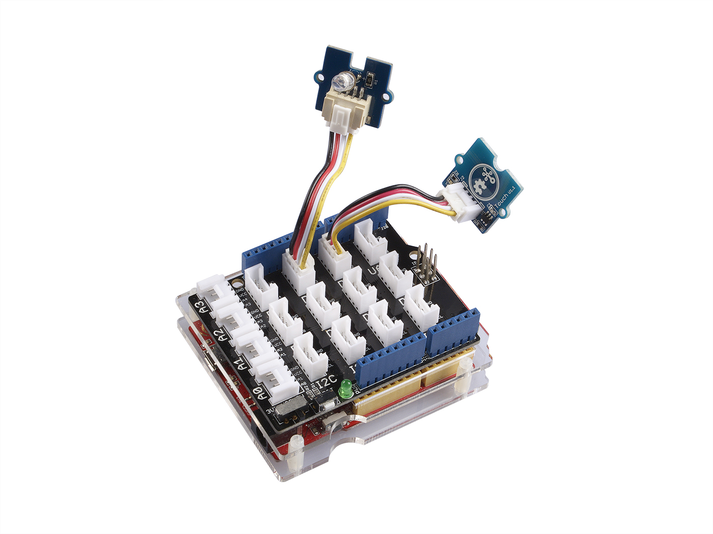

# Grove タッチセンサ

1つのデジタル端子を使い，人が触れているか否かを判別するためのセンサである．

- Grove - Touch Sensor https://wiki.seeedstudio.com/Grove-Touch_Sensor/

このセンサは動作電圧に制限はない．

## Arduinoとの接続例
デジタル端子1つに接続する必要があるため，Groveの端子に接続できるモジュールを用いる場合は，ケーブル1本で何れかのデジタル端子に接続すれば良い．

以下のイメージは，タッチセンサを触れた場合にLEDを点灯させるようなアプリケーションを想定した接続である．

[写真出典](https://wiki.seeedstudio.com/Grove-Touch_Sensor/)

## 接続先の情報

スイッチをどのピン(D0,D1など)に接続したかをメモしておく．

***

- [「センサ端末の詳細定義」に戻る](../SensorSelection.md)