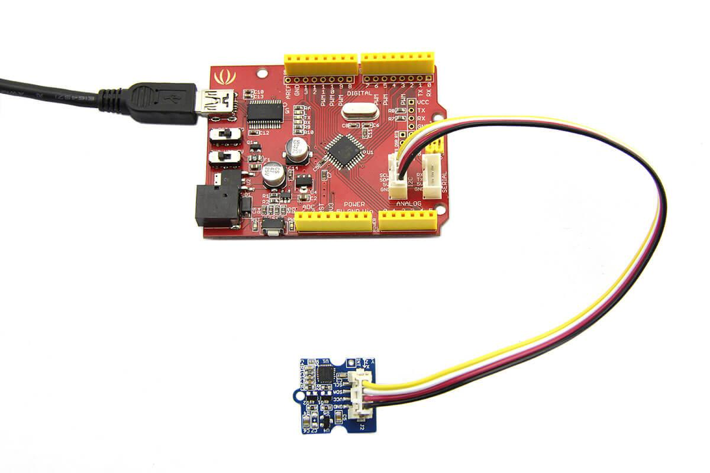

# ITG3200ジャイロセンサ

I2C接続で利用する3次元ジャイロセンサ．このセンサICを利用したセンサモジュールには，以下のようなものがある．

- [Grove 三軸デジタルジャイロ](https://jp.seeedstudio.com/Grove-3-Axis-Digital-Gyro.html)

チップの電源は2.1～3.6Vであるが，Groveのモジュールは3.3, 5Vの両方サポートしている．

なお，チップの製品情報は以下のURL(TDK)から入手可能
- https://product.tdk.com/ja/search/sensor/mortion-inertial/gyro/info?part_no=ITG-3200

## Arduinoとの接続例

上記のGroveのモジュールをArduino互換機と接続する場合，このモジュールはI2C接続となるため，MKRシリーズ用のGrove基板の場合は，「TWI」コネクタと接続する．

- [MKRシリーズ用Grove基板](https://store-usa.arduino.cc/products/arduino-mkr-connector-carrier-grove-compatible?selectedStore=us)

Uno等のクラシックシリーズ用のGrove基板の場合は，下の写真にも見えているように，「I2C」端子に接続する．
- [Unoシリーズ用Grove基板](https://jp.seeedstudio.com/Base-Shield-V2.html)

以下は，実際に接続した事例である．

[写真出典](https://wiki.seeedstudio.com/Grove-3-Axis_Digital_Gyro/)

## 接続先の情報

I2Cで接続する機器は特に情報をメモしておく必要はない．

***

- [「センサ端末の詳細定義」に戻る](../SensorSelection.md)

