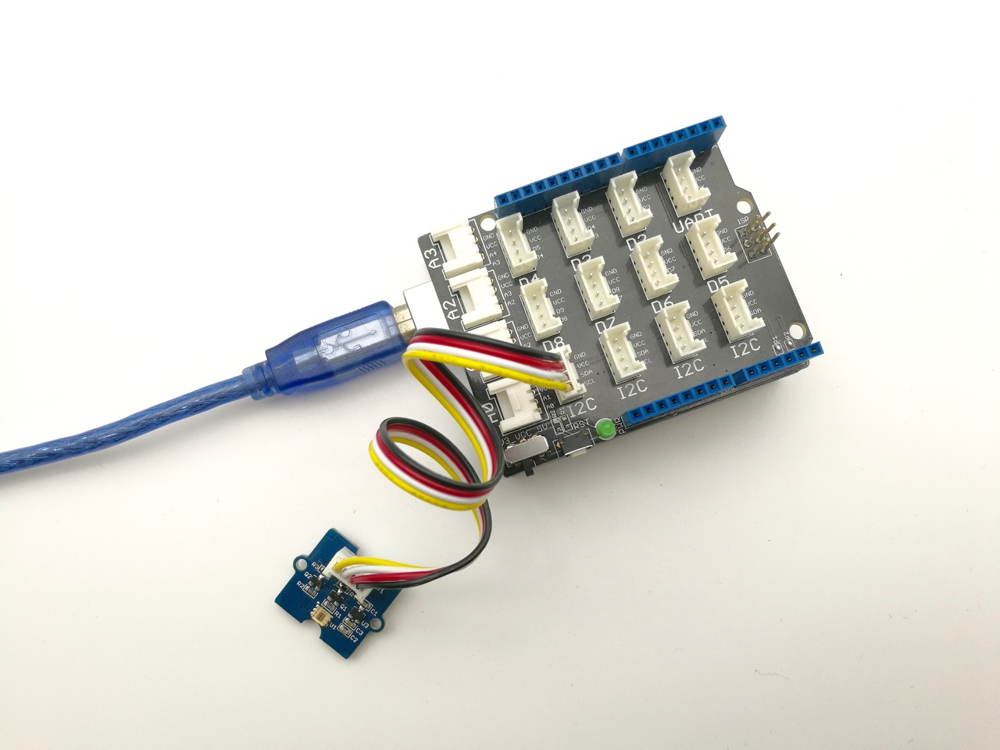

# TSL2561光センサ

TSL2561は照度を測定するセンサで，このICを使ったセンサモジュールには以下のようなものがある．

- Grove デジタルライトセンサ https://jp.seeedstudio.com/Grove-Digital-Light-Sensor-TSL2561.html
- Adafruit TSL2561 Digital Luminosity/Lux/Light Sensor Breakout https://www.adafruit.com/product/439

ただし，後者はすでに販売終了しているため，新規の入手はできない．

ICの動作電圧は2.7-3.6Vであるが，上記のモジュールのうち，Seeed StudioのGrove用モジュールは3.3V, 5V両方対応となっている．

## Arduinoとの接続方法

I2C接続となるため，MKRシリーズ用のGrove基板の場合は，「TWI」コネクタと接続する．

- [MKRシリーズ用Grove基板](https://store-usa.arduino.cc/products/arduino-mkr-connector-carrier-grove-compatible?selectedStore=us)

Uno等のクラシックシリーズ用のGrove基板の場合は，下の写真にも見えているように，「I2C」端子に接続する．
- [Unoシリーズ用Grove基板](https://jp.seeedstudio.com/Base-Shield-V2.html)

下の写真は，Groveのシールドを用いて接続した事例である．
- 画像出典 https://wiki.seeedstudio.com/Grove-Digital_Light_Sensor/

## 接続先の情報

I2Cで接続する機器は特にコネクタの情報をメモしておく必要はないが，アドレス端子をどこに接続接続したか，もしくは，接続しなかったかということは
メモしておく．

***

- [「センサ端末の詳細定義」に戻る](../SensorSelection.md)

