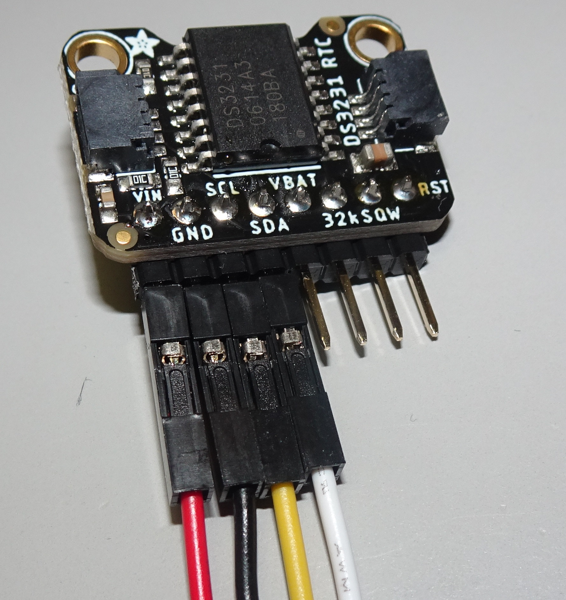

# RTCの時刻設定とその結果の確認

インターネット上のNTPサーバと通信できないArduinoは現在時刻を知ることができないため，
RTCを接続して現在時刻を取得するが，RTCに正しい時刻を設定する必要がある．

このために利用するプログラムが以下の2つである．

- ``NTP_and_setRTC``
- ``checkRTC``

## RTCの配線

### 推奨品
RTC(DS3231)の配線は，
[Grove用の変換ケーブル](https://www.seeedstudio.com/Grove-4-pin-Female-Jumper-to-Grove-4-pin-Conversion-Cable-5-PCs-per-PAck.html)を用いて，
VIN端子に赤色，GND端子に黒色，SCL端子に黄色，SDA端子に白色端子を接続する．

次に，[Grove用の変換ケーブル](https://www.seeedstudio.com/Grove-4-pin-Female-Jumper-to-Grove-4-pin-Conversion-Cable-5-PCs-per-PAck.html)の
Groveコネクタを用いて，Arduinoに接続したGrove用シールドのI2C端子につなげる．

### 非推奨
下記の2種類のRTCは，電池の問題があるため非推奨であるが，管理者の都合で用いる場合は以下の方法でArduinoのGroveシールドのI2C端子に接続する．

- [PCF8523](https://www.adafruit.com/product/5189)も基板のピン配置は同じなので，DS3231と同じ方法で配線できる．

- [DS1307](https://wiki.seeedstudio.com/Grove-RTC/)はGroveコネクタがあるため，GroveのケーブルでGrove用シールドと接続すれば良い．

## 利用するソフトウェア

### ``NTP_and_setRTC``

このプログラムは，Arduinoに電池を搭載したRTCモジュールを接続し，
NTPサーバと通信可能なネットワーク上で動作させることで，
RTCにNTPサーバから取得した時刻情報を書き込むものである．

最初に，インターネットに接続可能なネットワークを用意して，この
ブログラムをArduinoで動作させる．

本プログラムの使い方等は[こちら](NTP_and_setRTC/README.md)を参照のこと．

### ``checkRTC``
このプログラムは，Arduinoに接続されているRTCの時刻が正しいか否かを
判定するものである．

RTCは電池が繋がっていない状態で，電源断が発生すると，
以後，電源断で時刻情報が初期化されたことを示す
機能を持つ．

本プログラムは，上記機能を使って，RTCの時刻情報が設定後に
初期化されたか否かを見るものである．

そのため，``NTP_and_setRTC``で時刻を書き込んだ後，
このスケッチ(``checkRTC``)を書き込み，その後，
Arduinoの電源を切断(ACアダプタやUSB接続を切り離す)し，
再度USB接続してシリアル出力を確認することで，RTCの時刻情報が電源断で
初期化されているか否かを判定することができる．

このプログラムの使い方は[ここ](checkRTC/README.md)を参照．

***

- [「README」に戻る](../README.md)

