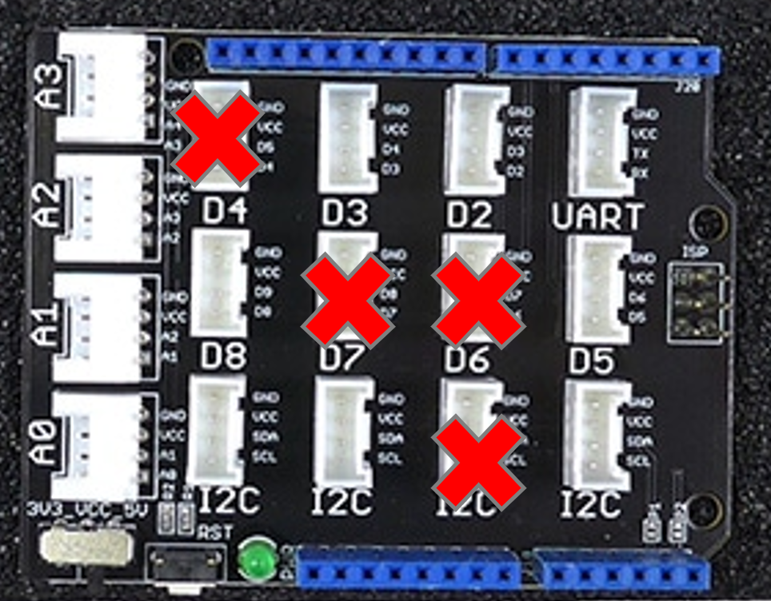

# センサの選択

本開発環境で生成されるセンサ端末用スケッチ(プログラム)では，1台のセンサ端末に搭載可能なセンサは1つに限られない．
ただし，同一種類(LSI/モジュール)のセンサは1つに限られる．もし，温湿度センサを複数搭載するような場合，異なるセンサチップのもの
を用いる必要がある．

また，温湿度センサや照度センサ等そもそも異なる種類のセンサであれば，1台のセンサ端末に搭載可能．
ただし，接続コネクタ(ピン)数やArduino本体の電源容量の制限に注意が必要．

以下は現状利用可能なセンサの一覧である．下のセンサの中から1つ以上のセンサを選択し，準備されている基本システムに接続する．
この時，接続したコネクタの種類(名前)と接続したコネクタの番号はメモしておく(I2Cのセンサは名前のみ)．

各センサの配線/接続方法はセンサ名のリンクを開いた先の資料に記述されているため，そちらを参照．
なお，表のGroveコネクタ列が「✕」のものは独自の配線が必要になるため要注意．

## 環境測定系センサ

|センサ名|温度|湿度|気圧|インターフェース|Groveコネクタ|
|---|---|---|---|---|---|
|[BME280](sensors/BME280.md)|◯|◯|◯|I2C|△|
|[BMP180](sensors/BMP180.md)|✕|✕|◯|I2C|◯|
|[SHT31](sensors/SHT31.md)|◯|◯|✕|I2C|△|
|[SHT2X](sensors/SHT2x.md)|◯|◯|✕|I2C|△|
|[AM232X](sensors/AM232X.md)|◯|◯|✕|I2C|△|
|[DHT](sensors/DHT.md)|◯|◯|✕|デジタル✕1|◯|
|[Grove - Temperature Sensor](sensors/Grove_Thermistor.md)|◯|✕|✕|アナログ✕1|◯|

### Groveコネクタ列
- ◯ Grove用のケーブルで直接接続可能
- △ 変換ケーブルで接続する必要がある
- ✕ ジャンパケーブルで配線する必要がある

## 振動・加速度等

|センサ名|加速度(軸数)|ジャイロ(軸数)|インターフェース|Groveコネクタ|
|---|---|---|---|---|
|[ITG320](sensors/ITG3200.md)|✕|3|I2C|◯|
|[MMA7660](sensors/MMA7660.md)|3|✕|I2C|◯|
|[ADXL345](sensors/ADXL345.md)|3|✕|I2C|◯|
|[ADXL335](sensors/ADXL335.md)|3|✕|アナログ✕3|✕|
|[村田ENC03R](sensors/ENC03R.md)|✕|1|アナログ✕1|◯|

### Groveコネクタ列
- ◯ Grove用のケーブルで直接接続可能
- △ 変換ケーブルで接続する必要がある
- ✕ ジャンパケーブルで配線する必要がある

## 接触等

|センサ名|接触|人感(赤外線)|インターフェース|Groveコネクタ|
|---|---|---|---|---|
|[GROVE - I2C タッチセンサ(MPR121)](sensors/GroveI2cTouch.md)|12(最大)|✕|I2C|◯|
|[Grove - Touch Sensor](sensors/DigitalTouchSensor.md)|1|✕|デジタル✕1|◯|
|[Grove - PIR Motion Sensor](sensors/PIR_Sensor.md)|✕|◯|デジタル✕1|◯|

### Groveコネクタ列
- ◯ Grove用のケーブルで直接接続可能
- △ 変換ケーブルで接続する必要がある
- ✕ ジャンパケーブルで配線する必要がある

## 視覚関連

|センサ名|照度|色彩|インターフェース|Groveコネクタ|
|---|---|---|---|---|
|[TCS34725](sensors/TCS34725.md)|✕|◯|I2C|△|
|[TSL2561](sensors/TSL2561.md)|◯|✕|I2C|△|

### Groveコネクタ列
- ◯ Grove用のケーブルで直接接続可能
- △ 変換ケーブルで接続する必要がある
- ✕ ジャンパケーブルで配線する必要がある

## その他

|センサ名|観測/測定対象|インターフェース|Groveコネクタ|
|---|---|---|---|
|[Grove - Switch](sensors/DigitalSwitch.md)|物理的な切り替え(スイッチ等)|デジタル✕1|◯|
|[Grove - Water Sensor](sensors/Grove_Water.md)|水の検知(端子間の短絡)|デジタル✕1|◯|
|[Grove - Line Finder](sensors/GroveLineFinder.md)|黒色の検出(赤外線反射)|デジタル✕1|◯|
|[Grove IR Distance Interrupter](sensors/Grove_IR_Distance_Interrupter.md)|物体検出(赤外線反射)|デジタル✕1|◯|
|[Grove - Infrared Reflective Sensor](sensors/Grove_IR_Refrective_Sensor.md)|物体検出(赤外線反射)|デジタル✕1|◯|
|[Grove - Rotary Angle Sensor](sensors/Rotary_Angle.md)|回転角度|アナログ✕1|◯|
|[Grove - Light Sensor](sensors/Grove_Analog_Light.md)|光の強弱(照度ではない)|アナログ✕1|◯|
|[Grove - Sound Sensor](sensors/Grove_Analog_Sound.md)|音の大小(デジタル値ではない)|アナログ✕1|◯|
|[Grove水分センサー](sensors/Grove_Moisture.md)|土の湿り気|アナログ✕1|◯|
|[Grove - GSR Sensor](sensors/Grove_Moisture.md)|体(手)の湿り気(汗)|アナログ✕1|◯|
|[Grove電流センサ](sensors/Grove_Current.md)|電流の強弱(正確な値ではない)|アナログ✕1|◯|

### Groveコネクタ列
- ◯ Grove用のケーブルで直接接続可能
- △ 変換ケーブルで接続する必要がある
- ✕ ジャンパケーブルで配線する必要がある

## センサを繋ぐGroveコネクタの選択
本プロジェクトで利用可能なセンサのうち，「[ADXL335](sensors/ADXL335.md)」以外は1つのGroveコネクタに接続可能である．
インターフェースとしてI2Cのものは，複数の機器が1つのコネクタに繋がっていても大丈夫であるため，ピン番号(コネクタ番号)は気にする必要がない．

それに対して，デジタルもしくはアナログインターフェースを持つセンサは1つの端子に1つのセンサ(もしくは周辺機器)しか接続できないため，
センサを接続するベースのシステムで既に利用されている端子がどれであるかを意識する必要がある．

典型的なベースのシステム毎に，センサが接続可能なGroveのコネクタがどれであるかを下の表に示す．
この表を各センサを接続する端子の選択と，定義ファイル(``config.yaml``)への記入の参考にすること．

|Groveコネクタ番号|MKR Zero+Ethernet|MKR WiFi 1010|Uno R4 Minima + Ether|Uno R4 WiFi|Nano 33 IoT|
|---|---|---|---|---|---|
|D0|◯|◯|－|－|
|D1|◯|◯|－|－|
|D2|◯|◯|◯|
|D3|◯|◯|◯|
|D4|✕|✕|✕|
|D5D6|✕|✕|－|－|
|D5|－|－|◯|
|D6|－|－|✕|
|D7|－|－|✕|
|D8|－|－|◯|
|A0|◯|◯|◯|
|A1|◯|◯|◯|
|A2|◯|◯|◯|
|A3|◯|◯|◯|
|A4|◯|◯|◯|
|A5A6|◯|◯|－|－|

### MKR Zero + MKR Ethernetシールド

センサ等を後に追加する場合に，I2C以外は既に使われている場所は利用できない．
Groveのコネクタのうち，D4,D5,D6とI2Cは既に使われている．
それを以下に示す．

### MKR WiFi1010 + マイクロSDシールド

センサ等を後に追加する場合に，I2C以外は既に使われている場所は利用できない．
それを以下に示す．

### Arduino Uno R4 Minima + Ethernetシールド

センサ等を後に追加する場合に，I2C以外は既に使われている場所は利用できない．

I2Cコネクタ4つのうちの1つとLEDで6番7番端子を使っているため，下のバツ印のところは利用不可である．

### Arduino Uno R4 WiFi + マイクロSDシールド

### Arduino Nano 33 IoT

センサ等を後に追加する場合に，I2C以外は既に使われている場所は利用できない．

I2CコネクタとLEDで6番7番端子を使っている．また，SPIで4つのピンを使っているが，対応するGroveコネクタが存在しないため，SPIは気にしなくて良い．

以上から，Groveシールドのうち，下図のバツ印のところは利用不可である．

***
- [「README」に戻る](../README.md)
