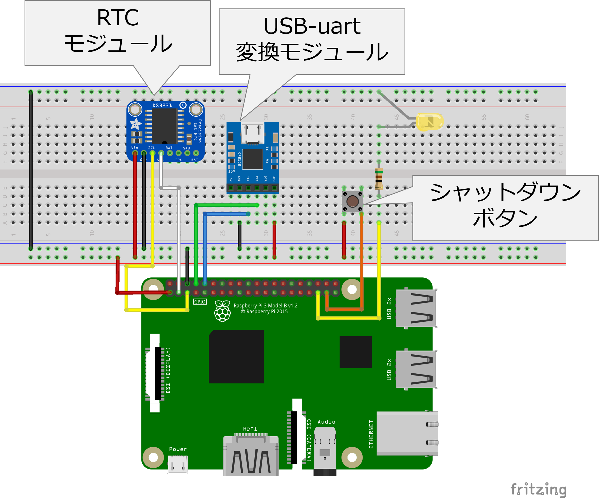
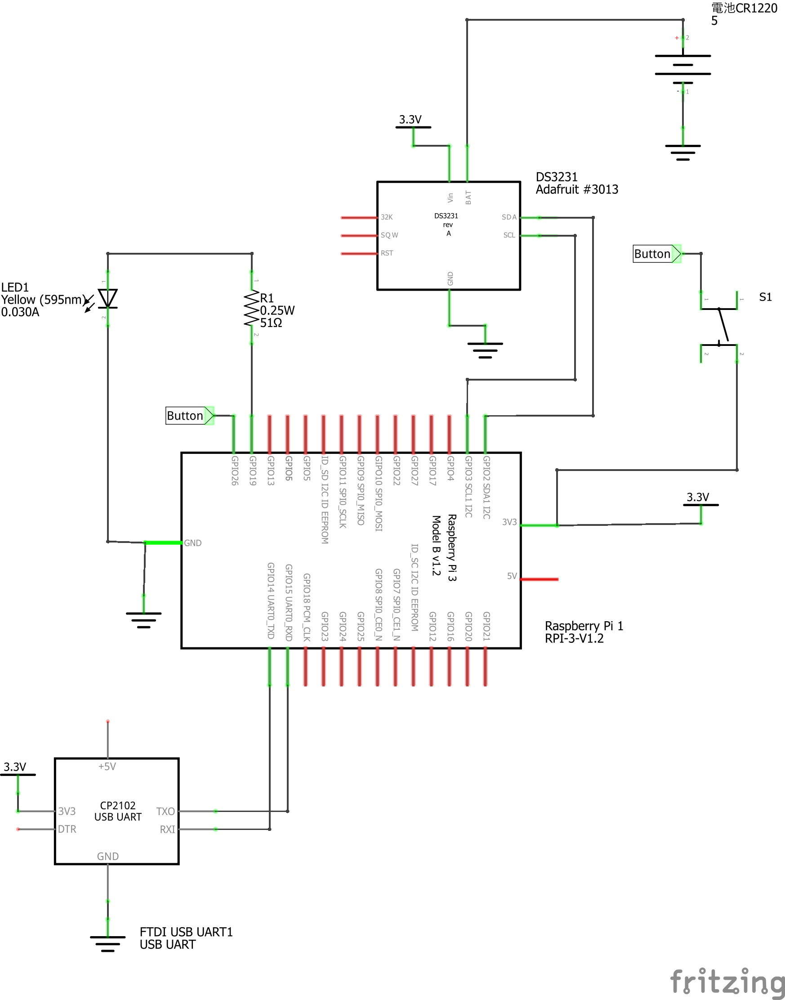

# IoTゲートウェイ用Raspberry Piの作成

IoTゲートウェイとしてRaspberry Piを運用する場合，キーボードやディスプレイ，マウスを持ち歩くのは
面倒である．

そのため，シリアルコンソール設けてPCとUSBケーブルで接続して各種の作業が行えるようにする．

また，ボタン一つでシャットダウンでき，シャットダウンの状況がLEDで確認できるようにする．

これを実現するRaspberry Pi用のHATを自作することになる．

## 配線イメージと回路図

下の図はブレッドボードを使って配線する場合のイメージである．RTCをI2Cに，USB-uart変換モジュールをUART端子に取付ける
必要がある．ボタンとLEDは特に縛りはないが，他のHATを積み重ねる可能性を考慮すると，SPI等に使われない
純粋なデジタルI/Oの端子が選ぶのが無難．

実際の配線図は下の図となる．

## 用意する部材

本体のRaspberry Piについては，接続するセンサ端末の数の問題などでCPU処理性能やメモリ容量に問題が発生しないかぎり，CPUの冷却等の面倒を避ける意味で4や5は勧めない．

- Raspberry Pi 本体 : 推奨 Pi 3 model B+ (https://www.raspberrypi.com/products/raspberry-pi-3-model-b-plus/)
- マイクロSD (16GB以上推奨)
- Raspberry Pi B+ Hat作成用ユニバーサル基板 (例 : https://www.switch-science.com/products/1905)
- 電池ボックス付きRTCモジュール DS3231を推奨 (例:https://www.adafruit.com/product/3013)
- FTDIチップ搭載USB uart変換モジュール (例: https://akizukidenshi.com/catalog/g/g108461/)
- LED (例: https://akizukidenshi.com/catalog/g/g111577/)
- スイッチ (例: https://akizukidenshi.com/catalog/g/g103646/)
- 電気抵抗 (抵抗値は自分で設計)

## 回路設計
LEDやスイッチについては電気抵抗を入れる必要があるため，この抵抗値を計算する必要がある．

Raspberry PiのGPIO端子は最大16mAまでしか流せないため，接続する周辺回路によっては，抵抗を使って電流を落とす必要がある．

### スイッチと電気抵抗

今回の製作では，シャットダウンボタンを押すと，スイッチを接続した端子に3.3Vが直接かかる．
ただし，安全を見るのであれば，上記の耐電流(16mA)と3.3Vの電圧から，``R=V/I``なので
約200オームの抵抗を入れた方が良い．

ただし，上記の回路図では，安全を取っていないため，スイッチを直結している．

### LEDと抵抗の選択

LEDはどれを使うかで異なるが，上に上げた秋月電子が販売しているLEDの場合，[データシート](https://akizukidenshi.com/goodsaffix/OSR5JA3Z74A.pdf)を参照すると
電流が流れた時にLEDで下がる電圧は1.8Vから2.6V (平均2.1V)となっている．また，消費電力は78mWである．

ただし，Raspberry Piの端子の電圧は3.3Vであることから，LEDにかかる電圧を下げてやる必要がある．

約1.5V下げると想定し，Raspberry PiのGPIO端子から出力される電流が16mAだとすると，必要な抵抗値は約100オームとなる．

***

- [「README」に戻る](../README.md)
