# 貸出しハードウェアを用いたシステム構築手順(管理者向け)

ここでは，貸出しハードウェアを用いるシステム管理者向けに，IoTシステムの基幹部分の構築手順を説明する．

そのため，本ドキュメントを読んだ後，[マニュアル](../Manual/Manual.md)も読んでいただきたい．

## システム構成の説明

下図は利用するIoTシステム全体のイメージ図である．
システム管理者やセンサ端末を開発するユーザの作業用PCをIoTネットワーク側に接続する場合は
IoTゲートウェイとなるRaspberry Piをインターネット/イントラネットに接続する必要はない．

一方，PCをインターネット/イントラネット側に接続する場合は，IoTゲートウェイを
WiFiでインターネット/イントラネットに接続しなければならない．


<div style="text-align: center;">
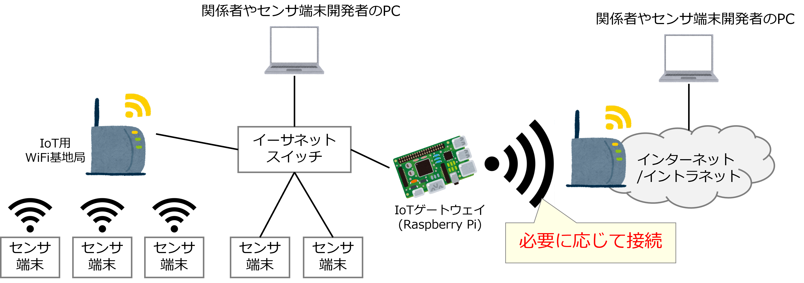
</div>

ただし，管理者やセンサ端末開発者のPCにいくつかのソフトウェアをインストールする必要がある．
そのため，PCをIoTネットワーク側に接続する場合は，上記のインストール作業後に行わなければならない．


## ソフトウェアのインストール

PCにインストールすべきソフトウェアは管理者とセンサ端末開発者で異なっている．

なお，各種ソフトウェアのインストールにおける具体的な手順等は
ここでは説明しない．詳細は手順書を参照していただきたい．

### 管理者
インストールが必須なのはターミナルソフトのみである．
- Windowsの場合: Teraterm等

動作確認のためには，以下のMQTTクライアントソフトもあった方が良い．
- MQTTBox等

本ドキュメントでは，MQTTBoxで説明する．

### センサ端末開発者

- MQTTクライアントソフト
- Arduino IDE
- Arduino IDE用各種ライブラリ

## Raspberry Piの組み立て

下図はIoTゲートウェイとして用いるRaspberry Piである．これを組み立てて，IoTゲートウェイとする．


<div style="text-align: center;">

</div>


まず最初にRaspberry Piを裏向けにして，マイクロSDをソケットに挿入する．
<div style="text-align: center;">
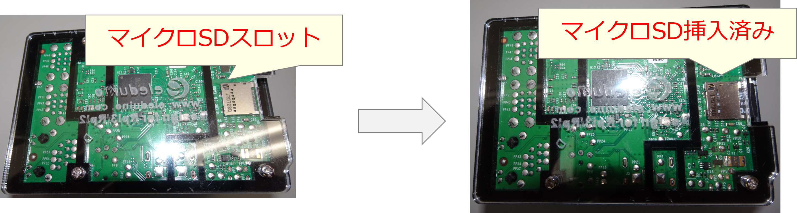
</div>


次に，USBシリアルインターフェースを基板(Raspberry PiのHat)上のピンに接続する．
<div style="text-align: center;">

</div>


## 機器の配線

次に，WiFi基地局，イーサネットスイッチ，Raspberry Piの配線を行う．


IoT gw(Raspberry pi)はイーサネットスイッチとイーサネットケーブルで接続した
上で，管理者のPCのUSBケーブル(マイクロUSB端子)で接続するが，この時点で
電源は接続しない．

<div style="text-align: center;">

</div>


この時点で，PCがUSBシリアルインターフェースがを認識していることを確かめる．
Windowsの場合は，デバイスマネージャーを開く．
下図のように，COMボートのところに，USBシリアルインターフェースが存在するはずである．
下図の場合は，COMポートの19番にUSBシリアルインターフェースが認識されている．


<div style="text-align: center;">
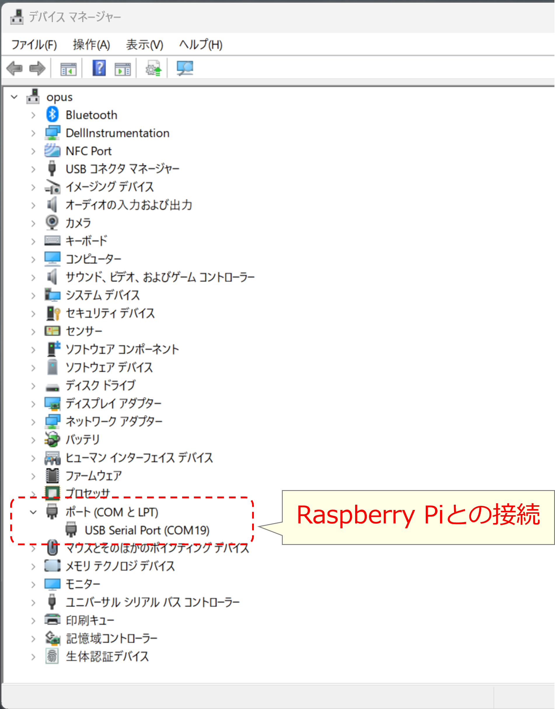
</div>


もし，認識していない場合は，以下のURLからデバイスドライバをダウンロードして，インストールする．

- デバイスドライバ配布元[https://ftdichip.com/drivers/d2xx-drivers/](https://ftdichip.com/drivers/d2xx-drivers/)


## IoT gwの設定変更

ここでは，IoT gwの設定変更作業を行う．


### ターミナルソフトによるコンソール接続
最初にターミナルソフトで先程確認したUSBシリアルインターフェースのポートを開く．

<div style="text-align: center;">
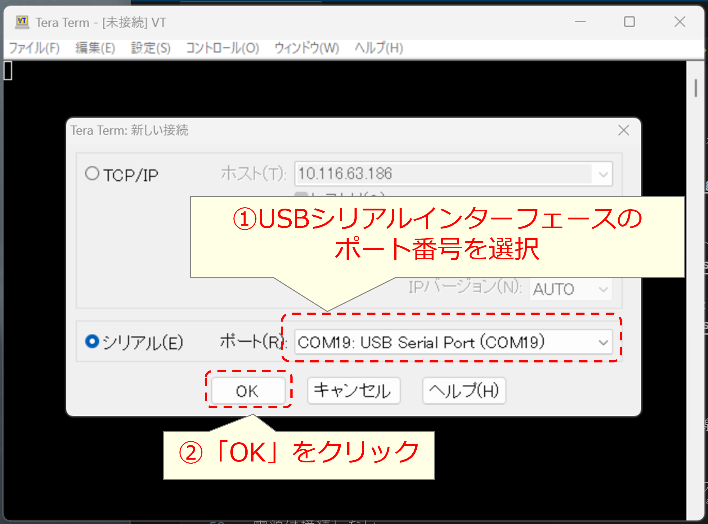
</div>

次に，ターミナルの通信速度を「115200bps」に設定する．

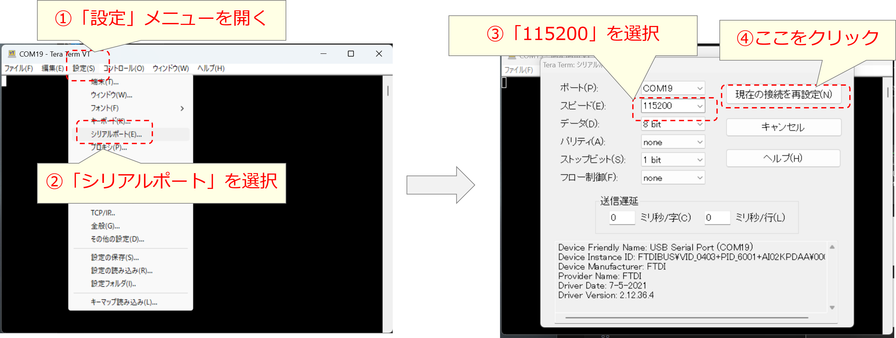


### IoT gwの起動

IoT gwであるRaspberry Piの電源(USB電源)を接続すると，シリアルターミナルに
起動画面が表示され，最終的に下図のようなログインプロンプトが表示されたところで
止まる．

<div style="text-align: center;">
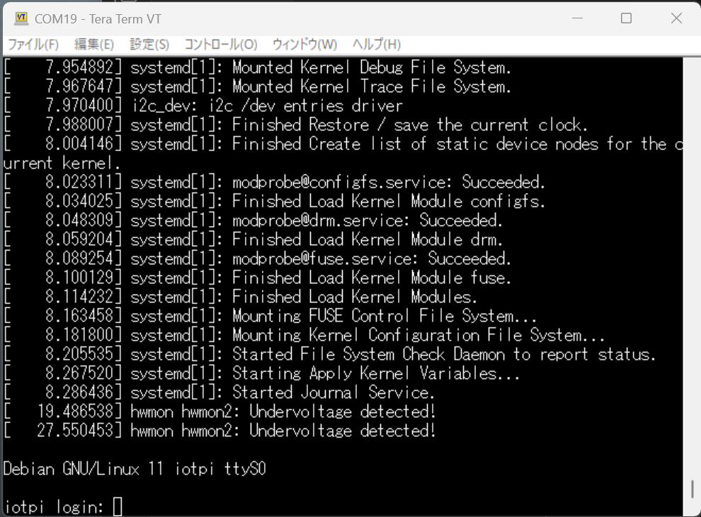
</div>

次に，ターミナル画面で以下のユーザ名とパスワードでログインする．

- ユーザ名 : iot-adm
- パスワード : iot-adm

<div style="text-align: center;">
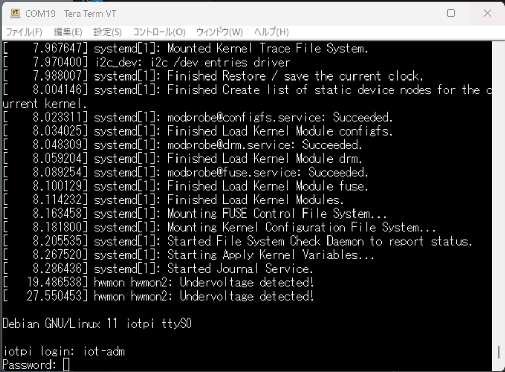
</div>


### 設定変更
まずはじめに，パスワードを変更する．

```
iot-adm@iotpi:~$ passwd
Changing password for iot-adm.
Current password:
New password:
Retype new password:
passwd: password updated successfully
iot-adm@iotpi:~$
```

次に，インターネット(もしくはイントラネット)に接続する場合は，
WiFiの接続を``raspi-config``コマンドで変更する．

```
iot-adm@iotpi:~$ sudo raspi-config
```

WiFi設定変更メニューを選択する．
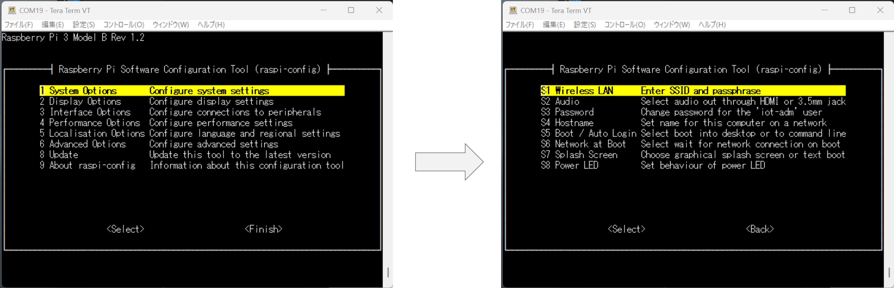

次に，SSIDとパスフレーズを入力する．

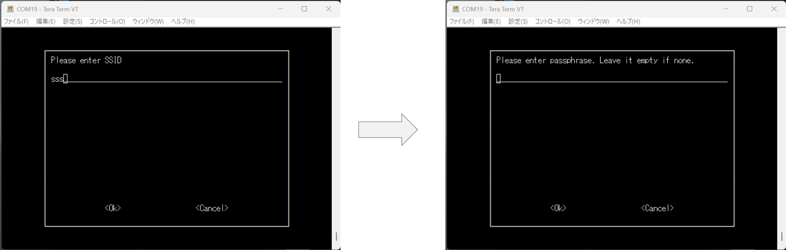

最後に，トップメニューで「``Finish``」を選択して，「``raspi-config``」を終了する．

<div style="text-align: center;">
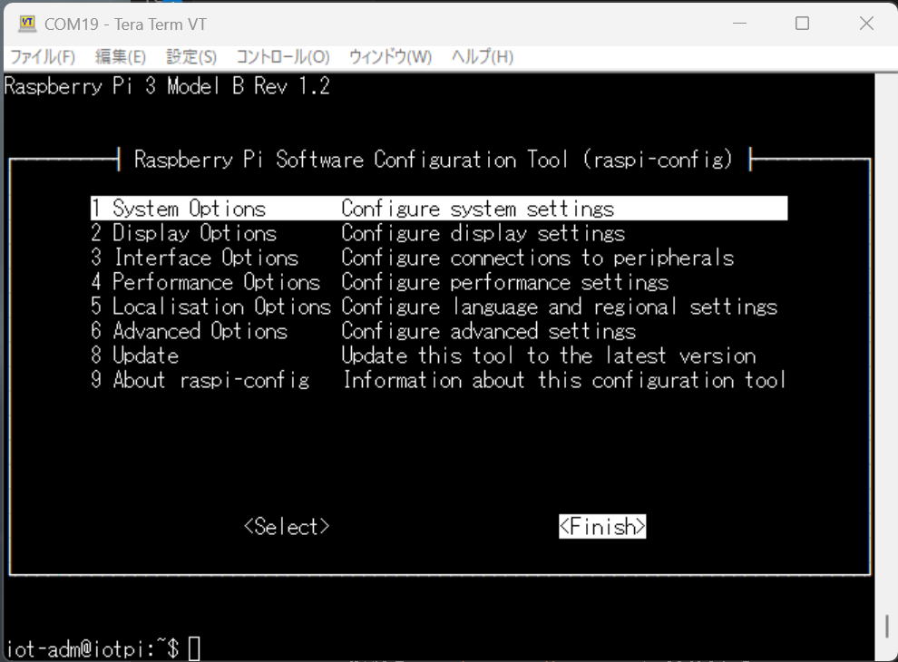
</div>


### 再起動と動作確認

コンソールで``reboot``コマンドを使う方法もあるが，ここでは，
動作確認も兼ねて，「シャットダウンボタン」を使う．

下図に示すように，基板(Hat)上の赤いボタンをしばらく押すと，シャットダウンが始まる．

<div style="text-align: center;">

</div>

シャットダウン中は下のように，LEDが点灯する．

<div style="text-align: center;">

</div>

この時，コンソール画面もシャットダウンが開始されていることが
示されるメッセージが表示されるはずである．

シャットダウンが最終段階になると，マイクロSDソケット横の
ミドリLEDが連続点滅し，最終的に消灯される．

<div style="text-align: center;">

</div>


この時，ターミナル画面には，電源断メッセージが出力されている．

<div style="text-align: center;">
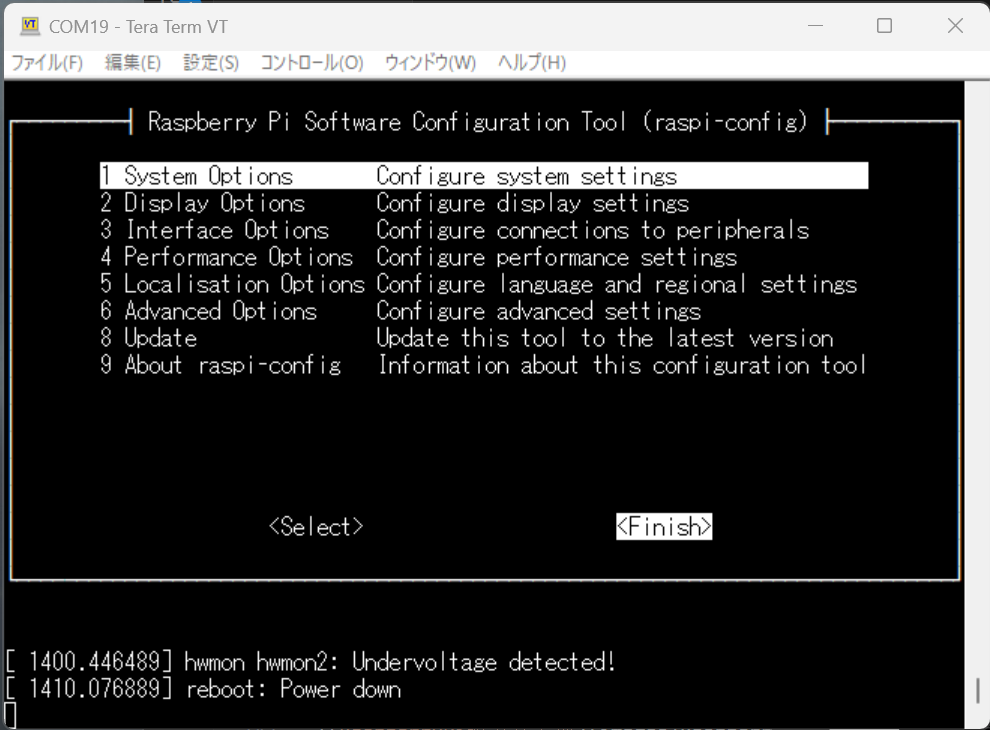
</div>

ここで，Raspberry Piの電源を抜き差しし，再起動させる．


再度ログインした上で，IPアドレスを``ifconfig -a``で表示し，ネットワークに接続
できていることを確認する．

下は，WiFiでインターネット/イントラネットに接続した状態であり，この場合は，IPアドレス(``inet 10.116.63.186``の部分)を
メモしておく．

<div style="text-align: center;">
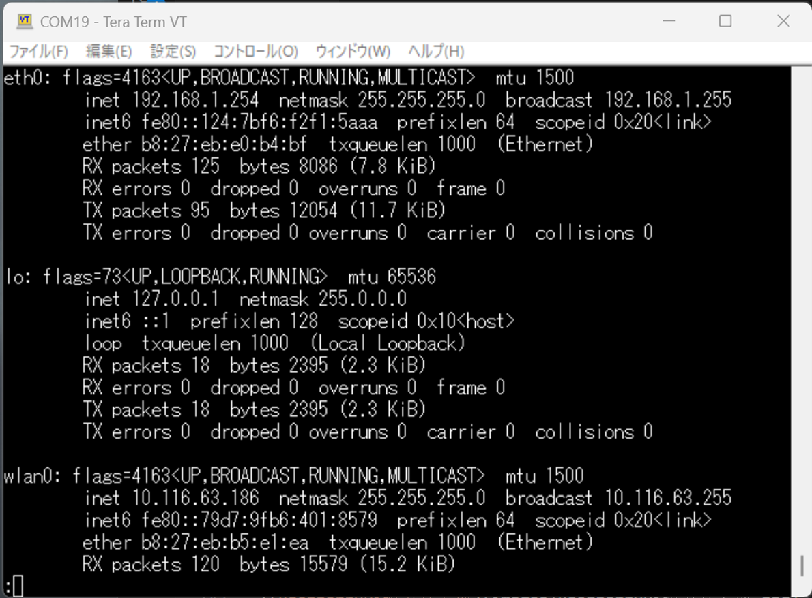
</div>


IoTネットワーク側のIPアドレスは``192.168.1.254``で固定なので，メモしておく必要はない．

次に，MQTTブローカである``mosquitto``の動作を確認する．
```
root@iotpi:/home/iot-adm# ps aux |grep mos
mosquit+     560  0.0  0.6  13964  6080 ?        Ss   13:39   0:00 /usr/sbin/mosquitto -c /etc/mosquitto/mosquitto.conf
root         901  0.0  0.0   8944   676 ttyS0    S+   13:54   0:00 grep mos
root@iotpi:/home/iot-adm#
```

CUIコマンドでmosquittoが動作しているかを確認する方法は以下の通り．下の``--topic``の部分は
適当に決めて構わない．
```
iot-adm@iotpi:~$ mosquitto_sub -d -t orz -h 127.0.0.1 --topic arduino/echo
Client (null) sending CONNECT
Client (null) received CONNACK (0)
Client (null) sending SUBSCRIBE (Mid: 1, Topic: orz, QoS: 0, Options: 0x00)
Client (null) sending SUBSCRIBE (Mid: 1, Topic: arduino/echo, QoS: 0, Options: 0x00)
Client (null) received SUBACK
Subscribed (mid: 1): 0, 0
```


MQTTクライアントによる接続や動作の確認方法は手順書の方を確認していただきたい．

## Arduino用スケッチのテンプレートカスタマイズ

最後に，センサ端末開発者の工数/ミス削減のため，
``トップディレクトリ/parts/config_template.yaml``を編集してWiFi接続の情報を
以下のように変更する．

```
network:
  wifi:
    ssid: "Buffalo-G-9C50" # ssid名
    wifi_pass: "jxgdekvmujfyh" # wifiパスワード
```

これで，センサ端末を開発/テスト/運用に必要なIoTネットワークの環境構築は終了となる．

## センサ端末開発者に渡すハードウェア


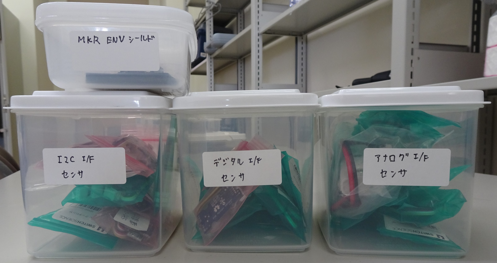


今回利用できるのは，以下の5機種


各本体に必要なシールドは既に組み立てた状態となっている．

そのため，Nano 33 IoT以外の機種は，開発者に渡す際には，RTCとフルカラーLEDを
取り付ければ良い．
Nano 33 IoTはマイクロSDのモジュールもジャンパケーブルで外付け
しないといけないことに注意．

開発者にRTCやLEDの接続を任せる場合は別として，
準備したハードウェアにはRTCとしてDS3231とPCF8523が混在しているため，どの機種にどちらのRTCを
接続したかはメモしておいてください．

基本的にハードウェア組み立ては，管理者が行うことを想定します．

また，組み立てについては，別途本プロジェクトのマニュアルを参照して作業してください．


## センサ端末開発者に渡す情報の準備

- IoT gwの情報
- IoTネットワーク側WiFiの情報
- MQTTの情報
- Arduinoの機種情報(組み立て済みArduinoを配布する場合)

### IoT gwの情報
センサ端末開発者はArduinoのSketchをカスタマイズする際に，
IoT gwのIoTネットワーク側のIPアドレスとMQTTブローカのポート番号が
必要になる．

今回のハードウェア環境では，Raspberry PiのIoTネットワーク側の
IPアドレスは192.168.1.254固定で，MQTTブローカ(mosquitto)の
ポート番号は1883であるため，これを伝達してください．


### IoTネットワークのWiFi情報
今回利用するIoTネットワーク用のWiFi基地局は
以下のようなSSIDとパスフレーズで接続できる．

|SSID|パスフレーズ|
|---|---|
|Buffalo-G-9C50|jxgdekvmujfyh|

上の表の情報も伝達してください．

### 個別センサ端末へ設定する情報
複数のセンサ端末を同時に動作させる場合，
MQTTのメッセージがどの機種のどのセンサから
出たものであるかを特定する必要がある．

これを区分するために，MQTTのトピックとセンサのID(整数)で
区別することになる．

そのため，例えば，以下のような指示をセンサ端末開発者に
出すことが考えられる．

- MQTTのtopic : Arduino/機種名
- 各センサのセンサID : 1から始まる整数

この時，機種名としてどのような文字列にするかは明確に指示すること．

|機種|機種名の文字列|
|---|---|
|MKR Zero | MKR_Zero |
|MKR WiFi 1010 | MKR_WiFi1010 |
|Uno R4 minima| UNO_R4 |
|Uno R4 WiFi| UNO_R4_WiFi |
|Nano 33 IoT | Nano_33_IoT |


***

- [「README」に戻る](../README.md)
